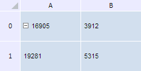

# TabSheetMeasures.MaxColumn

TabSheetMeasures.MaxColumn
-

**

# TabSheetMeasures.MaxColumn

## Синтаксис

MaxColumn: Number

## Описание

Свойство MaxColumn** устанавливает значение максимального количества столбцов в таблице.

## Комментарии

Значение свойства можно установить из JSON и с помощью метода setMaxColumn, а возвратить - с помощью метода getMaxColumn.

По умолчанию свойство содержит значение null.

## Пример

Для выполнения примера необходимо наличие на html-странице компонента [TabSheet](../../../Components/TabSheet/TabSheet/TabSheet.htm) с наименованием «tabSheet» (см. «[Пример создания компонента TabSheet](../../../Components/TabSheet/TabSheet/TabSheet_Example.htm)»).Изменим максимальное количество столбцов и строк в таблице:

// Получим измерения таблицы
var measures = tabSheet.getMeasures();
// Изменим значение максимального количества cтолбцов в таблице
measures.setMaxColumn(2);
// Изменим значение максимального количества строк в таблице
measures.setMaxRow(2);
// Перерисуем таблицу
tabSheet.rerender();

В результате выполнения примера было изменено значение максимального количества столбцов и строк в таблице:

См. также:

[TabSheetMeasures](TabSheetMeasures.htm)

		Справочная
		 система на версию 10.9
		 от 18/08/2025,
		 © ООО «ФОРСАЙТ»,
