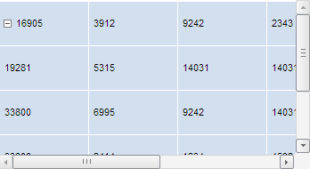

# TabSheetMeasures.VisibleColHeaders

TabSheetMeasures.VisibleColHeaders
-

# TabSheetMeasures.VisibleColHeaders

## Синтаксис

VisibleColHeaders: Boolean

## Описание

Свойство VisibleColHeaders управляет видимостью заголовков столбцов таблицы.

## Комментарии

Значение свойства устанавливается из JSON и с помощью метода setVisibleColHeaders, а возвращается - с помощью метода getVisibleColHeaders.

Если свойство равно true, то заголовки столбцов таблицы будут отображаться, иначе - не будут.

По умолчанию свойство равно true.

## Пример

Для выполнения примера необходимо наличие на html-странице компонента [TabSheet](../../../Components/TabSheet/TabSheet/TabSheet.htm) с наименованием «tabSheet» (см. «[Пример создания компонента TabSheet](../../../Components/TabSheet/TabSheet/TabSheet_Example.htm)»). Скроем заголовки столбцов и строк, а также сетку таблицы:

// Получим измерения таблицы
var measures = tabSheet.getMeasures();
// Скроем заголовки столбцов
measures.setVisibleColHeaders(false);
// Скроем заголовки строк
measures.setVisibleRowHeaders(false);
// Скроем сетку таблицы
measures.setVisibleGrid(false);
// Обновим таблицу
tabSheet.rerender();

В результате выполнения примера были скрыты заголовки строк и столбцов, а также сетка таблицы:

См. также:

[TabSheetMeasures](TabSheetMeasures.htm)

		Справочная
		 система на версию 10.9
		 от 18/08/2025,
		 © ООО «ФОРСАЙТ»,
