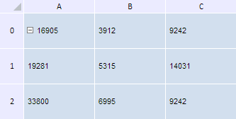

# TabSheetMeasures.deleteColumn

TabSheetMeasures.deleteColumn
-

**

# TabSheetMeasures.deleteColumn

## Синтаксис

deleteColumn(colIndex: Number, count: Number);

## Параметры

*colIndex.* Индекс первого удаляемого столбца таблицы;

*count.* Количество удаляемых столбцов таблицы.

## Описание

Метод deleteColumn** удаляет столбцы таблицы.

## Пример

Для выполнения примера необходимо наличие на html-странице компонента [TabSheet](../../../Components/TabSheet/TabSheet/TabSheet.htm) с наименованием «tabSheet» (см. «[Пример создания компонента TabSheet](../../../Components/TabSheet/TabSheet/TabSheet_Example.htm)»). Удалим три столбца с индексами 1, 2 и 3, а также три строки с индексами 0, 1 и 2:

// Получим измерения таблицы
var measures = tabSheet.getMeasures();
// Удаляем столбцы
measures.deleteColumn(1, 3);
// Удаляем строки
measures.deleteRow(0, 3);
// Обновим таблицу
tabSheet.rerender();

В результате выполнения данного примера будут удалены указанные стоки и столбцы таблицы:

См. также:

[TabSheetMeasures](TabSheetMeasures.htm)

		Справочная
		 система на версию 10.9
		 от 18/08/2025,
		 © ООО «ФОРСАЙТ»,
