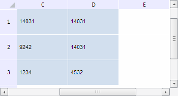

# TabSheetMeasures.getColumnPosByIndex

TabSheetMeasures.getColumnPosByIndex
-

**

# TabSheetMeasures.getColumnPosByIndex

## Синтаксис

getColumnPosByIndex(colIndex: Number);

## Параметры

*colIndex. Индекс
 столбца в таблице, позицию которого необходимо определить.*

## Описание

Метод getColumnPosByIndex**
 определяет позицию столбца в таблице по его индексу.

## Комментарии

Метод возвращает значение типа Number.

Позиция столбца соответствует его индексу без учёта прокрутки таблицы
 по горизонтали.

## Пример

Для выполнения примера необходимо наличие
 на html-странице компонента [TabSheet](../../../Components/TabSheet/TabSheet/TabSheet.htm)
 с наименованием «tabSheet» (см. «[Пример
 создания компонента TabSheet](../../../Components/TabSheet/TabSheet/TabSheet_Example.htm)»). Выполним прокрутку таблицы к строке
 с индексом 1 и к столбцу с индексом 2. Затем определим позиции данной
 строки и столбца в таблице:

// Получим измерения таблицы
var measures = tabSheet.getMeasures();
// Определим индексы строки и столбца таблицы
var rowIndex = 1;
var colIndex = 2;
// Выполним прокрутку к определённой строке и столбцу
tabSheet.scrollToRow(rowIndex);
tabSheet.scrollToColumn(colIndex);
// Получим позицию строки с указанным индексом
var rowPos = measures.getRowPosByIndex(rowIndex);
console.log("Позиция строки c индексом " + rowIndex + ": " + rowPos);
// Получим позицию столбца с указанным индексом
var columnPos = measures.getColumnPosByIndex(colIndex);
console.log("Позиция столбца с индексом " + colIndex + ": " + columnPos);

В результате выполнения примера таблица
 была прокручена к строке с индексом 1 и к столбцу с индексом 2:

При этом в консоли браузера были выведены
 позиции данной строки и столбца в таблице:

Позиция строки c индексом 1: 0

Позиция столбца с индексом 2: 0

См. также:

[TabSheetMeasures](TabSheetMeasures.htm)

		Справочная
		 система на версию 10.9
		 от 18/08/2025,
		 © ООО «ФОРСАЙТ»,
