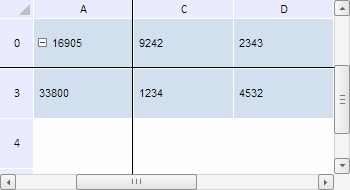

# TabSheetMeasures.getFirstColToScroll

TabSheetMeasures.getFirstColToScroll
-

**

# TabSheetMeasures.getFirstColToScroll

## Синтаксис

getFirstColToScroll();

## Описание

Метод getFirstColToScroll** возвращает индекс первого столбца, начиная с которого прокручена таблица.

## Комментарии

Метод возвращает значение типа Number.

## Пример

Для выполнения примера необходимо наличие на html-странице компонента [TabSheet](../../../Components/TabSheet/TabSheet/TabSheet.htm) с наименованием «tabSheet» (см. «[Пример создания компонента TabSheet](../../../Components/TabSheet/TabSheet/TabSheet_Example.htm)»). Зафиксируем первую строку и первый столбец таблицы, а затем прокрутим её к строке с индексом 3 и к столбцу с индексом 2. Далее определим индексы первого столбца и строки, начиная с которых выполнена прокрутка, и индексы последнего столбца и строки, к которым таблица была прокручена:

// Получим измерения таблицы
var measures = tabSheet.getMeasures();
// Зафиксируем строку и столбец с индексами 0
measures.setFixedRow(1);
measures.setFixedColumn(1);
// Выполним прокрутку к строке с индексом 1 и к столбцу с индексом 2
tabSheet.scrollToRow(3);
tabSheet.scrollToColumn(2);
console.log("Индекс первого столбца, начиная с которого прокручена таблица: " + measures.getFirstColToScroll());
console.log("Индекс первой строки, начиная с которой прокручена таблица: " + measures.getFirstRowToScroll());
console.log("Индекс последнего столбца, к которому прокручена таблица: " + measures.getLastColumnToScroll());
console.log("Индекс последней строки, к которой прокручена таблица: " + measures.getLastRowToScroll());

В результате выполнения примера были зафиксированы первая строка и первый столбец таблицы, а также выполнена прокрутка её к строке с индексом 3 и к столбцу с индексом 2:

При этом в консоли браузера были выведены индексы первого столбца и строки, начиная с которых выполнена прокрутка, и индексы последнего столбца и строки, к которым таблица была прокручена:

Индекс первого столбца, начиная с которого прокручена таблица: 1

Индекс первой строки, начиная с которой прокручена таблица: 1

Индекс последнего столбца, к которому прокручена таблица: 4

Индекс последней строки, к которой прокручена таблица: 4

См. также:

[TabSheetMeasures](TabSheetMeasures.htm)

		Справочная
		 система на версию 10.9
		 от 18/08/2025,
		 © ООО «ФОРСАЙТ»,
