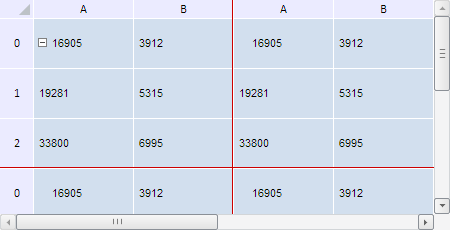

# TabSheetMeasures.getFixedColumnCount

TabSheetMeasures.getFixedColumnCount
-

**

# TabSheetMeasures.getFixedColumnCount

## Синтаксис

getFixedColumnCount(isVirtual: Boolean);

## Параметры

*isVirtual. Признак того, нужно ли учитывать виртуальные столбцы таблицы при подсчёте их количества. Если параметр равен значению true, то виртуальные столбцы будут учитываться при этом, иначе - не будут.*

## Описание

Метод getFixedColumnCount** возвращает количество фиксированных столбцов таблицы.

## Комментарии

Метод возвращает значение типа Number.

## Пример

Для выполнения примера необходимо наличие на html-странице компонента [TabSheet](../../../Components/TabSheet/TabSheet/TabSheet.htm) с наименованием «tabSheet» (см. «[Пример создания компонента TabSheet](../../../Components/TabSheet/TabSheet/TabSheet_Example.htm)»). Очистим кеш измерений таблицы и кеш размеров её видимой части. Далее зафиксируем первые два столбца и первые три строки таблицы так, чтобы они не выделялись при нажатии на них. Определим их количество, общую высоту и ширину. Для линий фиксации установим красный цвет границы и отобразим их:

// Получим измерения таблицы
var measures = tabSheet.getMeasures();
// Очистим кеш измерений таблицы
measures.invalidateCache();
// Очистим кеш размеров видимой части таблицы
measures.invalidateVisibleTableSizeCache();
// Зададим крайний фиксированный столбец
measures.setFixedColumn(2);
// Зададим крайнюю фиксированную строку
measures.setFixedRow(3);
// Установим красный цвет линий фиксации
measures.setFixedAreaLineColor("#CC0000");
var isDisplayFixedAreaLines = measures.getDisplayFixedAreaLines();
if (isDisplayFixedAreaLines == null) {
    isDisplayFixedAreaLines = true
};
// Отобразим линии фиксации
measures.setDisplayFixedAreaLines(isDisplayFixedAreaLines);
console.log("Количество фиксированных столбцов: " + measures.getFixedColumnCount());
console.log("Количество фиксированных строк: " + measures.getFixedRowCount());
console.log("Общая ширина фиксированных столбцов: " + measures.getFixedWidth());
console.log("Общая высота фиксированных строк: " + measures.getFixedHeight());
// Указываем, что фиксированные строки/столбцы не будут выделяться при нажатии на них
measures.setFixedBehaviour(PP.Ui.TabFixedBehaviour.Off);
// Увеличим размеры таблицы
tabSheet.setWidth(450);
tabSheet.setHeight(230);
// Обновим таблицу
tabSheet.rerender();

В результате выполнения примера был очищен кеш измерений таблицы и кеш размеров её видимой части. Первые два столбца и первые три строки были зафиксированы так, чтобы при нажатии они полностью не выделялись. Линия фиксации была окрашена в красный цвет:

В консоли браузера было выведено количество фиксированных столбцов и строк таблицы, а также их общая ширина и высота соответственно:

Количество фиксированных столбцов: 2

Количество фиксированных строк: 3

Общая ширина фиксированных столбцов: 233

Общая высота фиксированных строк: 168

См. также:

[TabSheetMeasures](TabSheetMeasures.htm)

		Справочная
		 система на версию 10.9
		 от 18/08/2025,
		 © ООО «ФОРСАЙТ»,
