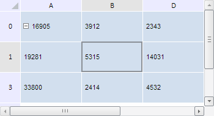

# TabSheetMeasures.getNextBottomCoord

TabSheetMeasures.getNextBottomCoord
-

**

# TabSheetMeasures.getNextBottomCoord

## Синтаксис

getNextBottomCoord(coord: PP.Ui.[TabSheetCoord](../TabSheetCoord/TabSheetCoord.htm));

## Параметры

*coord. Координаты
 ячейки таблицы.*

## Описание

Метод getNextBottomCoord**
 возвращает координаты ячейки, расположенной на одну строку ниже ячейки
 с указанными координатами.

## Комментарии

Метод возвращает объект типа PP.Ui.[TabSheetCoord](../TabSheetCoord/TabSheetCoord.htm).

## Пример

Для выполнения примера необходимо наличие на html-странице компонента
 [TabSheet](../../../Components/TabSheet/TabSheet/TabSheet.htm)
 с наименованием «tabSheet» (см. «[Пример
 создания компонента TabSheet](../../../Components/TabSheet/TabSheet/TabSheet_Example.htm)»). Примем ячейку B1 за исходную, выделим
 её, а строку и столбец, расположенные соответственно ниже и правее, скроем.
 Далее определим размеры исходной ячейки, координаты соседних ячеек и индексы
 граничащих с ней нескрытых строк и столбцов:

// Получим измерения таблицы
var measures = tabSheet.getMeasures();
// Определим функцию для вывода координат ячеек
var showCoord = function (coord) {
    var str;
    if (coord != null) {
        var str = "(" + coord.rowIndex + ", " + coord.colIndex + ")"
    }
    return str
}
// Получим координаты ячейки B1
var coord = tabSheet.coord(1, 1);
console.log("Координаты исходной ячейки: " + this.showCoord(coord));
// Выделим ячейку
tabSheet.select(tabSheet.getCell(coord));
// Получим размеры данной ячейки
var size = measures.getCoordSize(coord);
console.log("Ширина ячейки: " + size.width + ", высота: " + size.height);
// Скроем строку и столбец, расположенные соответственно ниже и правее исходной ячейки
measures.addHiddenRow(coord.rowIndex + 1);
measures.addHiddenColumn(coord.colIndex + 1);
// Обновим таблицу
tabSheet.rerender();
// Определим координаты ячеек, расположенных вокруг исходной ячейки
console.log("Координаты ячейки, расположенной на одну строку выше: " + showCoord(measures.getNextTopCoord(coord)));
console.log("Координаты ячейки, расположенной на один столбец правее: " + showCoord(measures.getNextRightCoord(coord)));
console.log("Координаты ячейки, расположенной на одну строку ниже: " + showCoord(measures.getNextBottomCoord(coord)));
console.log("Координаты ячейки, расположенной на один столбец левее: " + showCoord(measures.getNextLeftCoord(coord)));
// Определим индексы нескрытых строк и столбцов, граничащих с заданной ячейкой
console.log("Индекс следующего нескрытого столбца: " + measures.getNextNonHiddenColumn(coord.colIndex));
console.log("Индекс предыдущего нескрытого столбца: " + measures.getPreviousNonHiddenColumn(coord.colIndex));
console.log("Индекс следующей нескрытой строки: " + measures.getNextNonHiddenColumn(coord.rowIndex));
console.log("Индекс предыдущей нескрытой строки: " + measures.getPreviousNonHiddenColumn(coord.rowIndex));

В результате выполнения примера исходная ячейка B1 была выделена, а
 строка и столбец, расположенных соответственно ниже и правее неё,
 были скрыты:

В консоли браузера были выведены координаты и размеры исходной ячейки,
 координаты соседних ячеек, а также индексы нескрытых строк и столбцов,
 граничащих с ней:

Координаты исходной ячейки: (1, 1)

Ширина ячейки: 100, высота: 50

Координаты ячейки, расположенной на одну строку
 выше: (0, 1)

Координаты ячейки, расположенной на один столбец
 правее: (1, 3)

Координаты ячейки, расположенной на одну строку
 ниже: (3, 1)

Координаты ячейки, расположенной на один столбец
 левее: (1, 0)

Индекс следующего нескрытого столбца: 3

Индекс предыдущего нескрытого столбца: 0

Индекс следующей нескрытой строки: 3

Индекс предыдущей нескрытой строки: 0

См. также:

[TabSheetMeasures](TabSheetMeasures.htm)

		Справочная
		 система на версию 10.9
		 от 18/08/2025,
		 © ООО «ФОРСАЙТ»,
