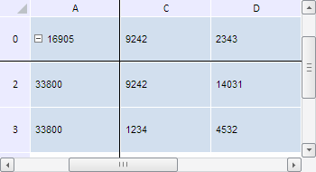

# TabSheetMeasures.getScrollableColIndexes

TabSheetMeasures.getScrollableColIndexes
-

**

# TabSheetMeasures.getScrollableColIndexes

## Синтаксис

getScrollableColIndexes();

## Описание

Метод getScrollableColIndexes** возвращает индексы столбцов таблицы, обладающих возможностью прокрутки.

## Комментарии

Метод возвращает массив значений типа Number.

## Пример

Для выполнения примера необходимо наличие на html-странице компонента [TabSheet](../../../Components/TabSheet/TabSheet/TabSheet.htm) с наименованием «tabSheet» (см. «[Пример создания компонента TabSheet](../../../Components/TabSheet/TabSheet/TabSheet_Example.htm)»). Зафиксируем первую строку и столбец таблицы, а затем определим индексы строк и столбцов, обладающих возможностью прокрутки. Для наглядности примера прокрутим таблицу по горизонтали и вертикали:

// Получим измерения таблицы
var measures = tabSheet.getMeasures();
console.log("Индексы прокручиваемых строк: " + measures.getScrollableRowIndexes());
console.log("Индексы прокручиваемых столбцов: " + measures.getScrollableColIndexes());
// Зафиксируем первые строку и столбец таблицы
measures.getTabSheet().setFixedRow(0);
measures.getTabSheet().setFixedColumn(0);
console.log("Индексы прокручиваемых строк после фиксации: " + measures.getScrollableRowIndexes());
console.log("Индексы прокручиваемых столбцов после фиксации: " + measures.getScrollableColIndexes());
// Прокрутим таблицу по горизонтали и по вертикали
measures.getTabSheet().scrollHorizontal(250);
measures.getTabSheet().scrollVertical(150);

В результате выполнения примера были зафиксированы первая строка и столбец, а сама таблица была прокручена на 250 пикселей по горизонтали и 150 пикселей по вертикали:

В консоли браузера были выведены индексы строк и столбцов, обладающих возможностью прокрутки, до и после фиксации:

Индексы прокручиваемых строк: 0,1,2,3

Индексы прокручиваемых столбцов: 0,1,2,3

Индексы прокручиваемых строк после фиксации: 1,2,3,4

Индексы прокручиваемых столбцов после фиксации: 1,2,3,4

См. также:

[TabSheetMeasures](TabSheetMeasures.htm)

		Справочная
		 система на версию 10.9
		 от 18/08/2025,
		 © ООО «ФОРСАЙТ»,
