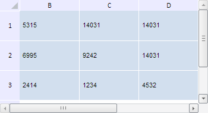

# TabSheetMeasures.getVisibleColIndexes

TabSheetMeasures.getVisibleColIndexes
-

**

# TabSheetMeasures.getVisibleColIndexes

## Синтаксис

getVisibleColIndexes();

## Описание

Метод getVisibleColIndexes** возвращает массив индексов видимых столбцов таблицы.

## Комментарии

Метод возвращает массив значений типа Number.

## Пример

Для выполнения примера необходимо наличие на html-странице компонента [TabSheet](../../../Components/TabSheet/TabSheet/TabSheet.htm) с наименованием «tabSheet» (см. «[Пример создания компонента TabSheet](../../../Components/TabSheet/TabSheet/TabSheet_Example.htm)»). Скроем первые строку и столбец таблицы. Затем определим количество видимых столбцов, их индексы и общую ширину, для строк - их количество, индексы и общую высоту. Также получим количество видимых ячеек по умолчанию:

// Получим измерения таблицы
var measures = tabSheet.getMeasures();
// Скроем первую строку и столбец
measures.addHiddenRow(0);
measures.addHiddenColumn(0);
// Обновим таблицу
tabSheet.rerender();
// Получим размеры видимой части таблицы
var sizes = measures.getVisibleTableSize();
// Получим информацию о столбцах таблицы
console.log("Данные о столбцах:");
console.log("  Количество видимых столбцов: " + measures.getVisibleColumnsCount());
console.log("  Индексы видимых столбцов: " + measures.getVisibleColIndexes());
console.log("  Общая ширина видимых столбцов: " + sizes.colWidth);
// Получим информацию о строках таблицы
console.log("Данные о строках:");
console.log("  Количество видимых строк: " + measures.getVisibleRowsCount());
console.log("  Индексы видимых строк: " + measures.getVisibleRowIndexes());
console.log("  Общая высота видимых строк: " + sizes.rowHeight);
console.log("Количество видимых ячеек по умолчанию: " + measures.getVisibleDefaultCellsCount());

В результате выполнения примера были скрыты первые строка и столбец таблицы:

В консоли браузера было выведено количество видимых столбцов таблицы, их индексы и общая ширина. Для видимых строк было определено их количество, индексы и общая высота. Также было выведено количество видимых ячеек по умолчанию:

Данные о столбцах:

  Количество видимых столбцов: 4

  Индексы видимых столбцов: 1,2,3,4,5

  Суммарная ширина видимых столбцов: 433

Данные о строках:

  Количество видимых строк: 4

  Индексы видимых строк: 1,2,3,4,5

  Суммарная высота видимых строк: 218

Количество видимых ячеек по умолчанию: 16

См. также:

[TabSheetMeasures](TabSheetMeasures.htm)

		Справочная
		 система на версию 10.9
		 от 18/08/2025,
		 © ООО «ФОРСАЙТ»,
