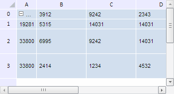

# TabSheetMeasures.insertColumn

TabSheetMeasures.insertColumn
-

**

# TabSheetMeasures.insertColumn

## Синтаксис

insertColumn(afterColIndex: Number, size: Number,
 count: Number);

## Параметры

*afterColIndex.* Индекс столбца, после
 которого будет осуществлена вставка;

*size. Ширина вставляемых столбцов;*

*count.* Количество столбцов для вставки.

## Описание

Метод insertColumn** вставляет
 столбцы в таблицу.

## Пример

Для выполнения примера необходимо наличие на html-странице компонента
 [TabSheet](../../../Components/TabSheet/TabSheet/TabSheet.htm)
 с наименованием «tabSheet» (см. «[Пример
 создания компонента TabSheet](../../../Components/TabSheet/TabSheet/TabSheet_Example.htm)»). Вставим один новый столбец и две новые
 строки в начало таблицы:

// Получим измерения таблицы
var measures = tabSheet.getMeasures();
// Вставим новый столбец шириной 30 пикселей
measures.insertColumn(0, 40, 1);
// Вставим две новые строки высотой 20 пикселей
measures.insertRow(0, 20, 2);
// Перерисуем таблицу
tabSheet.rerender();

В результате выполнения примера в таблицу были вставлены две строки
 высотой в 20 пикселей и один столбец шириной в 40 пикселей:

См. также:

[TabSheetMeasures](TabSheetMeasures.htm)

		Справочная
		 система на версию 10.9
		 от 18/08/2025,
		 © ООО «ФОРСАЙТ»,
