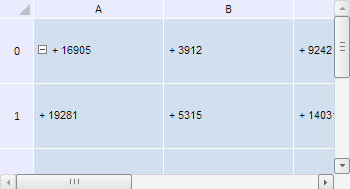

# TabSheetMeasures.iterateLeftOffset

TabSheetMeasures.iterateLeftOffset
-

**

# TabSheetMeasures.iterateLeftOffset

## Синтаксис

iterateLeftOffset(action: function, context: Object, isVirtual: Boolean, reverseCalc: Boolean);

## Параметры

*action.* Функция, вызываемая при каждом обходе значений ширины столбцов таблицы;

*context.* Контекст, из которого вызван данный метод. Необязательный параметр, по умолчанию равен текущему контексту this;

*isVirtual.* Признак, показывающий, какие координаты используются - виртуальные или реальные. Если параметр равен true, то используются виртуальные координаты, иначе - реальные. Необязательный параметр, по умолчанию равен значению false;

*reverseCalc.* Признак, определяющий направление обхода по значениям ширины столбцов таблицы. Если параметр равен значению true, то обход начинается со значения ширины последнего столбца, если false - то наоборот. Необязательный параметр, по умолчанию равен значению false.

## Описание

Метод iterateLeftOffset** перебирает значения ширины столбцов таблицы.

## Пример

Для выполнения примера необходимо наличие на html-странице компонента [TabSheet](../../../Components/TabSheet/TabSheet/TabSheet.htm) с наименованием «tabSheet» (см. «[Пример создания компонента TabSheet](../../../Components/TabSheet/TabSheet/TabSheet_Example.htm)»). Изменим ширину столбцов и высоту строк таблицы, а также добавим символ «+» к значениям каждой ячейки:

// Получим измерения таблицы
var measures = tabSheet.getMeasures();
// Объявим вспомогательные переменные
var i = 0;
var oldLeftOffset = 0;
var oldTopOffset = 0;
// Установим коэффициент новой ширины и высоты столбцов и строк таблицы
var k = 1.3;
// Изменим значение ширины каждого столбца таблицы
measures.iterateLeftOffset(function (leftOffset) {
    if (i == 0) {
        oldLeftOffset = leftOffset;
    } else {
        var newLeftOffset = (leftOffset - oldLeftOffset);
        oldLeftOffset += newLeftOffset;
        tabSheet.setColumnWidth((newLeftOffset * k), (i - 1));
    }
    i++
});
i = 0; // Обнулим счетчик
// Изменим значение высоты каждой строки таблицы
measures.iterateTopOffset(function (topOffset) {
    if (i == 0) {
        oldTopOffset = topOffset;
    } else {
        var newTopOffset = (topOffset - oldTopOffset);
        oldTopOffset += newTopOffset;
        tabSheet.setRowHeight((newTopOffset * k), (i - 1));
    }
    i++
});
// Добавим символ «+» к значению каждой ячейки
measures.eachVisibleCoord(function (coord) {
    var value = tabSheet.getModel().getCell(coord).CellData.FormattedText;
    tabSheet.setCellValue("+ " + value, coord.rowIndex, coord.colIndex)
});

В результате выполнения примера ширина столбцов и высота строк таблицы были увеличены в 1.3 раза, а к значениям каждой ячейки таблицы был добавлен символ «+»:

См. также:

[TabSheetMeasures](TabSheetMeasures.htm)

		Справочная
		 система на версию 10.9
		 от 18/08/2025,
		 © ООО «ФОРСАЙТ»,
