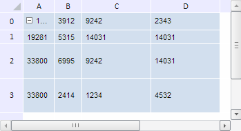

# TabSheetMeasures.setColumnsWidth

TabSheetMeasures.setColumnsWidth
-

**

# TabSheetMeasures.setColumnsWidth

## Синтаксис

setColumnsWidth(value: Array);

## Параметры

*value. Массив значений ширины столбцов таблицы.*

## Описание

Метод setColumnsWidth** устанавливает новые значения ширины столбцов таблицы.

## Пример

Для выполнения примера необходимо наличие на html-странице компонента [TabSheet](../../../Components/TabSheet/TabSheet/TabSheet.htm) с наименованием «tabSheet» (см. «[Пример создания компонента TabSheet](../../../Components/TabSheet/TabSheet/TabSheet_Example.htm)»). Установим новые значения ширины и высоты для первых двух столбцов и строк таблицы:

// Получим измерения таблицы
var measures = tabSheet.getMeasures();
// Зададим новые значения ширины столбцов с индексами 0 и 1
measures.setColumnsWidth([45, 40]);
// Зададим новые значения высоты строк с индексами 0 и 1
measures.setRowsHeight([25, 20]);
//Перерисуем таблицу
tabSheet.rerender();

В результате выполнения примера была уменьшена ширина и высота первых двух столбцов и строк таблицы:

См. также:

[TabSheetMeasures](TabSheetMeasures.htm)

		Справочная
		 система на версию 10.9
		 от 18/08/2025,
		 © ООО «ФОРСАЙТ»,
