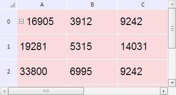

# TabSheetModel.DefaultStyle

TabSheetModel.DefaultStyle
-

**

# TabSheetModel.DefaultStyle

## Синтаксис

DefaultStyle: PP.Ui.[TabSheetCellStyle](../TabSheetCellStyle/TabSheetCellStyle.htm)

## Описание

Свойство DefaultStyle** устанавливает для ячеек таблицы стиль по умолчанию.

## Комментарии

Значение свойства устанавливается из JSON и с помощью метода setDefaultStyle, а возвращается с помощью метода getDefaultStyle.

## Пример

Для выполнения примера необходимо наличие на html-странице компонента [TabSheet](../../../Components/TabSheet/TabSheet/TabSheet.htm) с наименованием «tabSheet» (см. «[Пример создания компонента TabSheet](../../../Components/TabSheet/TabSheet/TabSheet_Example.htm)»). Получим для ячеек таблицы стиль по умолчанию, изменим цвет заливки и размер шрифта, а затем установим измененный стиль в качестве стиля по умолчанию и добавим его в массив стилей модели таблицы:

// Получим модель данных таблицы
var model = tabSheet.getModel();
// Получим стиль по умолчанию
var defaultStyle = model.getDefaultStyle();
// Изменим цвет заливки
defaultStyle.Fill.Color = "#FADADD";
// Изменим размер шрифта
defaultStyle.Font.Size = 20;
// Заменим стиль по умолчанию
model.setDefaultStyle(defaultStyle);
// Добавим в массив стилей
model.setStyles([defaultStyle]);
// Перерисуем таблицу
tabSheet.rerender();

В результате выполнения примера для ячеек таблицы был получен стиль по умолчанию, для которого установлен розовый цвет заливки и размер шрифта, равный 20 пикселям:

Затем данный стиль снова был задан в качестве стиля по умолчанию и добавлен в массив стилей модели таблицы.

См. также:

[TabSheetModel](TabSheetModel.htm)

		Справочная
		 система на версию 10.9
		 от 18/08/2025,
		 © ООО «ФОРСАЙТ»,
