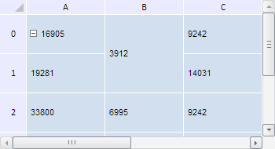

# TabSheetModel.clearCellSpans

TabSheetModel.clearCellSpans
-

**

# TabSheetModel.clearCellSpans

## Синтаксис

clearCellSpans();

## Описание

Метод clearCellSpans** очищает границы внутри диапазона объединённых ячеек таблицы.

## Пример

Для выполнения примера необходимо наличие на html-странице компонента [TabSheet](../../../Components/TabSheet/TabSheet/TabSheet.htm) с наименованием «tabSheet» (см. «[Пример создания компонента TabSheet](../../../Components/TabSheet/TabSheet/TabSheet_Example.htm)»). Создадим объединение ячеек B0 и B1, а затем очистим границы внутри созданного диапазона объединённых ячеек:

// Получим диапазон ячеек по заданным координатам
var range = tabSheet.getRange(1, 0, 1, 1);
// Выполним объединение ячеек по полученному диапазону
tabSheet.merge(range);
// Обновим таблицу
tabSheet.rerender();
// Очистим границы всех объединений ячеек
tabSheet.getModel().clearCellSpans();

В результате выполнения примера было создано объединение ячеек B0 и B1, а затем внутри него были очищены границы:

См. также:

[TabSheetModel](TabSheetModel.htm)

		Справочная
		 система на версию 10.9
		 от 18/08/2025,
		 © ООО «ФОРСАЙТ»,
