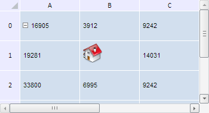
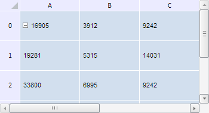

# TabSheetModel.clearObjects

TabSheetModel.clearObjects
-

**

# TabSheetModel.clearObjects

## Синтаксис

clearObjects();

## Описание

Метод clearObjects** удаляет все объекты в таблице.

## Пример

Для выполнения примера необходимо наличие на html-странице компонента [TabSheet](../../../Components/TabSheet/TabSheet/TabSheet.htm) с наименованием «tabSheet» (см. «[Пример создания компонента TabSheet](../../../Components/TabSheet/TabSheet/TabSheet_Example.htm)»), а также компонента [TabSheetObject](../TabSheetObject/TabSheetObject.htm) (см. страницу описания метода [TabSheet.addObject](../TabSheet/TabSheet.addObject.htm)). Таблица с добавленным в неё объектом выглядит следующим образом:

Теперь удалим данный объект:

// Получим модель данных таблицы
var model = tabSheet.getModel();
// Удалим группировки ячеек таблицы
model.clearObjects();

В результате выполнения примера все объекты из таблицы были удалены:

См. также:

[TabSheetModel](TabSheetModel.htm)

		Справочная
		 система на версию 10.9
		 от 18/08/2025,
		 © ООО «ФОРСАЙТ»,
