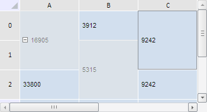

# TabSheetModel.eachCellSpan

TabSheetModel.eachCellSpan
-

**

# TabSheetModel.eachCellSpan

## Синтаксис

eachCellSpan(action: function, context);

## Параметры

*action.* Функция, которую нужно выполнить для каждого объединения ячеек таблицы;

*context.* Контекст, из которого вызван данный метод.

## Описание

Метод eachCellSpan** выполняет указанную функцию для каждого объединения ячеек таблицы.

## Пример

Для выполнения примера необходимо наличие на html-странице компонента [TabSheet](../../../Components/TabSheet/TabSheet/TabSheet.htm) с наименованием «tabSheet» (см. «[Пример создания компонента TabSheet](../../../Components/TabSheet/TabSheet/TabSheet_Example.htm)»). Создадим три диапазона объединённых ячеек и выделим их:

// Получим диапазоны ячеек по заданным координатам
var range1 = tabSheet.getRange(0, 0, 0, 1);
var range2 = tabSheet.getRange(1, 1, 1, 2);
var range3 = tabSheet.getRange(2, 0, 2, 1);
// Выполним объединение ячеек по полученным диапазонам
tabSheet.merge(range1);
tabSheet.merge(range2);
tabSheet.merge(range3);
// Обновим таблицу
tabSheet.rerender();
// Получим модель данных таблицы
var model = tabSheet.getModel();
// Выделим все объединения ячеек
model.eachCellSpan(function (cellSpan) {
    tabSheet.select(cellSpan.getRange(tabSheet), true);
}, this);

В результате выполнения примера были созданы и выделены три диапазона объединённых ячеек:

См. также:

[TabSheetModel](TabSheetModel.htm)

		Справочная
		 система на версию 10.9
		 от 18/08/2025,
		 © ООО «ФОРСАЙТ»,
