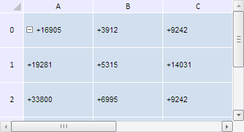

# TabSheetModel.getCells

TabSheetModel.getCells
-

**

# TabSheetModel.getCells

## Синтаксис

getCells();

## Описание

Метод getCells** возвращает
 все ячейки таблицы.

## Комментарии

Метод возвращает массив, элементами которого являются массивы ячеек
 таблицы, являющихся объектами типа PP.Ui.[TabSheetCell](../TabSheetCell/TabSheetCell.htm).
 Причём индексы вложенных массивов должны соответствовать индексам строк,
 а индексы элементов, представляющих ячейки - их координатам в таблице.

## Пример

Для выполнения примера необходимо наличие на html-странице компонента
 [TabSheet](../../../Components/TabSheet/TabSheet/TabSheet.htm)
 с наименованием «tabSheet» (см. «[Пример
 создания компонента TabSheet](../../../Components/TabSheet/TabSheet/TabSheet_Example.htm)»). Получим массив, содержащий все ячейки
 таблицы, и добавим к значению каждой ячейки в данном массиве символ «+»:

// Получим модель данных таблицы
var model = tabSheet.getModel();
// Получим ячейки таблицы
var cells = model.getCells();
// Для каждой ячейки в массиве добавим к значению символ «+»
for (var i = 0; i < cells.length; i++) {
  var coord = cells[i].getCoord();
  tabSheet.setCellValue("+" + cells[i].CellData.FormattedText, coord.rowIndex, coord.colIndex)
};
var cell = model.getCell(0);
console.log(cell.CellData.FormattedText);

В результате выполнения примера к значению каждой ячейки таблицы был
 добавлен символ «+»:

См. также:

[TabSheetModel](TabSheetModel.htm)

		Справочная
		 система на версию 10.9
		 от 18/08/2025,
		 © ООО «ФОРСАЙТ»,
