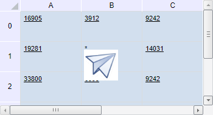

# TabSheetModel.getTabObjectPictures

TabSheetModel.getTabObjectPictures
-

**

# TabSheetModel.getTabObjectPictures

## Синтаксис

getTabObjectPictures();

## Описание

Метод getTabObjectPictures**
 возвращает массив значков, являющихся объектами.

## Комментарии

Метод возвращает массив значений типа Object.

## Пример

Для выполнения примера необходимо наличие на html-странице компонента
 [TabSheet](../../../Components/TabSheet/TabSheet/TabSheet.htm)
 с наименованием «tabSheet» (см. «[Пример
 создания компонента TabSheet](../../../Components/TabSheet/TabSheet/TabSheet_Example.htm)»).

В файл [Expanders.js](../../../Components/TabSheet/TabSheet/TabSheet_Example.htm#json)
 добавьте изображение в закодированном виде [base64](https://www.base64-image.de/)
 перед параметрами "Structure":

"TabObjectsImages": {
    "TabObjectImage": [
        {
            "@I": 1, // Идентификатор объекта
            "asImage": "iVBORw0KGgoAAAANSUhEUgAAABAAAAAQCAYAAAAf8/9hAAAAGXRFWHRTb2Z0d2FyZQBBZG9iZSBJbWFnZ..."// Base64 объекта
        }
    ]
}
Выполните в консоли:

// Создадим новый объект для таблицы
var tabSheetObject = new PP.Ui.TabSheetObject({
        Data: {
            "@I": 1, // Идентификатор объекта
            "@TR": 1, // Индекс строки ячейки, в область которой вставляем объект
            "@LC": 1, // Индекс столбца ячейки, в область которой вставляем объект
            "@T": 14, // Отступ сверху
            "@L": 5, // Отступ слева
            "@H": 51, // Высота объекта
            "@W": 56 // Ширина объекта
        },
        Parent: tabSheet
    });
// Добавим объект в таблицу
tabSheet.addObject(tabSheetObject);
// Получим модель таблицы
var model = tabSheet.getModel();
model.getTabObjectPictures();
// Проверим параметр объекта css
if (css = "icontabSheet1_0") {
    // При совпадении параметра установим символ «*» в ячейке, в пределах которой расположен левый верхний угол объекта
    var coord = tabSheetObject.getCoord();
    tabSheet.setCellValue("*", coord.rowIndex, coord.colIndex);
    } else {
        console.log("Объект с заданным параметром не существует");
};
После выполнения примера в таблицу будет добавлен объект, в ячейку B1,
 в пределах которой расположен левый верхний угол объекта, запишется символ
 «*»:

См. также:

[TabSheetModel](TabSheetModel.htm)

		Справочная
		 система на версию 10.9
		 от 18/08/2025,
		 © ООО «ФОРСАЙТ»,
