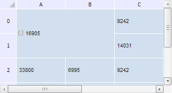
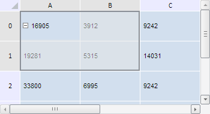

# TabSheetModel.removeCellSpan

TabSheetModel.removeCellSpan
-

**

# TabSheetModel.removeCellSpan

## Синтаксис

removeCellSpan(span: PP.Ui.[TabSheetCellSpan](../TabSheetCellSpan/TabSheetCellSpan.htm));

## Параметры

*span.* Объединение ячеек, которое нужно удалить.

## Описание

Метод removeCellSpan** удаляет объединение ячеек из модели таблицы.

## Пример

Для выполнения примера необходимо наличие на html-странице компонента [TabSheet](../../../Components/TabSheet/TabSheet/TabSheet.htm) с наименованием «tabSheet» (см. «[Пример создания компонента TabSheet](../../../Components/TabSheet/TabSheet/TabSheet_Example.htm)»). Объединим ячейки из диапазона A0-B1, а затем удалим созданное объединение и выделим исходный диапазон:

// Получим диапазон ячеек по заданным координатам
var range = tabSheet.getRange(0, 0, 1, 1);
// Объединим ячейки в указанном диапазоне
tabSheet.merge(range);
var isRemove = confirm("Удалить объединение?");
if (isRemove) {
    // Получим объединение
    var span = tabSheet.getCellSpanUnderCoord(tabSheet.coord(0, 0));
    // Получим модель данных таблицы
    var model = tabSheet.getModel();
    // Удалим объединение ячеек из модели
    model.removeCellSpan(span);
    model.getTabSheet().rerender();
    // Выделим диапазон ячеек
    range.select();
};

В результате выполнения примера были объединены ячейки в диапазоне (0, 0) - (1, 1):

После этого был показан диалог, запрашивающий подтверждение на удаление диапазона объединённых ячеек. В результате нажатия кнопки «OK» данный диапазон был разбит на отдельные ячейки и выделен:

См. также:

[TabSheetModel](TabSheetModel.htm)

		Справочная
		 система на версию 10.9
		 от 18/08/2025,
		 © ООО «ФОРСАЙТ»,
