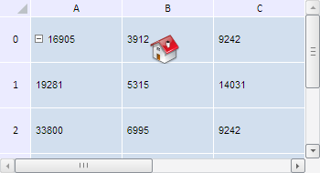

# Конструктор TabSheetObject

Конструктор TabSheetObject
-

**

# Конструктор TabSheetObject

## Синтаксис

PP.Ui.TabSheetObject(settings);

## Параметры

*settings.* JSON-объект со значениями
 свойств класса.

## Описание

Конструктор TabSheetObject**
 создает экземпляр класса **TabSheetObject.**

## Пример

Для выполнения примера необходимо наличие на html-странице компонента
 [TabSheet](../../../Components/TabSheet/TabSheet/TabSheet.htm)
 с наименованием «tabSheet» (см. «[Пример
 создания компонента TabSheet](../../../Components/TabSheet/TabSheet/TabSheet_Example.htm)»). В папке с данной html-страницей должна
 существовать папка «img» с графическим файлом «home.png». Создадим и добавим
 новый объект в таблицу, указав его идентификатор, тип, имя класса,
 адрес значка и экземпляр пользовательского объекта:

// Создадим новый объект для таблицы
var tabSheetObject = new PP.Ui.TabSheetObject({
    Data: {
        "@TR": 0, // Индекс столбца ячейки, в область которой вставляем объект
        "@LC": 1, // Индекс строки ячейки, в область которой вставляем объект
    },
    Parent: tabSheet,
    // Зададим минимальную высоту объекта
    MinHeight: 100,
    // Зададим минимальную ширину объекта
    MinWidth: 100
    // Зададим способ перемещения объекта - "Перемещение и изменение вместе с ячейками"
    MovementMode: PP.Ui.TabObjectMovementMode.FreeWithCells
});
// Зададим имя класса
tabSheetObject.setClassName("PP.Ui.TabSheetObject");
// Зададим адрес значка
tabSheetObject.setUrl("img/home.png");
// Идентификатор объекта
tabSheetObject.setIdent("tabSheetHomeIconObject");
// Установим тип объекта «значок»
tabSheetObject.setObjectType(PP.Ui.TabSheetObjectType.Image);
// Вставляем объект в таблицу
tabSheet.addObject(tabSheetObject);

В результате выполнения примера в таблицу был добавлен объект, для которого
 задан идентификатор, тип, имя класса, адрес значка и экземпляр пользовательского
 объекта:

См. также:

[TabSheetObject](TabSheetObject.htm)

		Справочная
		 система на версию 10.9
		 от 18/08/2025,
		 © ООО «ФОРСАЙТ»,
