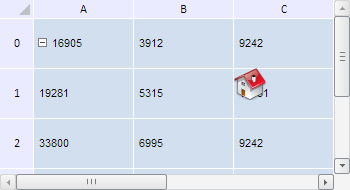

# TabSheetObject.TopLeftCoord

TabSheetObject.TopLeftCoord
-

**

# TabSheetObject.TopLeftCoord

## Синтаксис

TopLeftCoord: PP.Ui.[TabSheetCoord](../TabSheetCoord/TabSheetCoord.htm)

## Описание

Свойство TopLeftCoord** определяет координаты верхнего левого угла объекта в таблице.

## Комментарии

Значение свойства устанавливается из JSON и с помощью метода setTopLeftCoord, а возвращается с помощью метода getTopLeftCoord.

## Пример

Для выполнения примера необходимо наличие на html-странице компонента [TabSheet](../../../Components/TabSheet/TabSheet/TabSheet.htm) с наименованием «tabSheet» (см. «[Пример создания компонента TabSheet](../../../Components/TabSheet/TabSheet/TabSheet_Example.htm)»), а также компонента [TabSheetObject](TabSheetObject.htm) (см. страницу «[Конструктор TabSheetObject](Constructor_TabSheetObject.htm)»). Переместим объект в ячейку C1 и уберём все отступы от её границ:

// Определим координаты ячейки C1 и её размеры
var coord = tabSheet.coord(1, 2);
// Разместим объект в ячейке C1
tabSheetObject.setTopLeftCoord(coord);
// Обнулим отступы от границы ячейки C1
tabSheetObject.setTop(0);
tabSheetObject.setLeft(0);
// Перерисуем таблицу
tabSheetObject.getTabSheet().rerender();

В результате выполнения примера объект будет размещён в ячейке с координатами (1, 2), а верхний и левый отступы от её верхней и левой границы будут убраны:

См. также:

[TabSheetObject](TabSheetObject.htm)

		Справочная
		 система на версию 10.9
		 от 18/08/2025,
		 © ООО «ФОРСАЙТ»,
