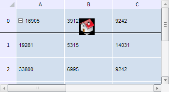

# TabSheetObject.isHorizontallyFixedLineCrossed

TabSheetObject.isHorizontallyFixedLineCrossed
-

**

# TabSheetObject.isHorizontallyFixedLineCrossed

## Синтаксис

isHorizontallyFixedLineCrossed();

## Описание

Метод isHorizontallyFixedLineCrossed** определяет, пересекает ли объект в таблице горизонтальную линию фиксации.

## Комментарии

Метод возвращает значение true, если объект пересекает горизонтальную линию фиксации, иначе - значение false.

## Пример

Для выполнения примера необходимо наличие на html-странице компонента [TabSheet](../../../Components/TabSheet/TabSheet/TabSheet.htm) с наименованием «tabSheet» (см. «[Пример создания компонента TabSheet](../../../Components/TabSheet/TabSheet/TabSheet_Example.htm)») и компонента [TabSheetObject](TabSheetObject.htm) (см. страницу «[Конструктор TabSheetObject](Constructor_TabSheetObject.htm)»). Зафиксируем первый столбец и строку таблицы и определим, пересекает ли объект вертикальную и горизонтальную линию фиксации:

// Зададим фиксированный столбец
tabSheet.setFixedColumn(0);
// Зададим фиксированную строку
tabSheet.setFixedRow(0);
// Определим, пересекает ли объект горизонтальную линию фиксации
var isHorCrossed = tabSheetObject.isHorizontallyFixedLineCrossed();
console.log("Объект " + (isHorCrossed ? "пересекает" : "не пересекает") + " горизонтальную линию фиксации.");
// Определим, пересекает ли объект вертикальную линию фиксации
var isVerCrossed = tabSheetObject.isVerticallyFixedLineCrossed();
console.log("Объект " + (isVerCrossed ? "пересекает" : "не пересекает") + " вертикальную линию фиксации.");

В результате выполнения примера были зафиксированы первый столбец и строка таблицы:

Определено, что объект пересекает только горизонтальную линию фиксацию, о чём в консоли браузера было выведено соответствующее сообщение:

Объект пересекает горизонтальную линию фиксации.

Объект не пересекает вертикальную линию фиксации.

См. также:

[TabSheetObject](TabSheetObject.htm)

		Справочная
		 система на версию 10.9
		 от 18/08/2025,
		 © ООО «ФОРСАЙТ»,
