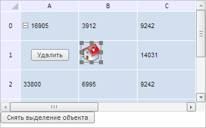
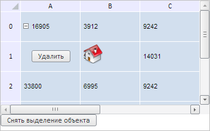

# TabSheetObjectSelection.select

TabSheetObjectSelection.select
-

**

# TabSheetObjectSelection.select

## Синтаксис

select(object: PP.Ui.[TabSheetObject](../TabSheetObject/TabSheetObject.htm), saveCurrentSelections: Boolean);

## Параметры

*object.* Объект в таблице, который нужно выделить;

*saveCurrentSelections.* Признак дополнительного выделения (если равен значению true, то новое выделение будет добавлено к существующему, если false, то старое выделение будет сброшено).

## Описание

Метод select** выделяет указанный объект в таблице.

## Пример

Для выполнения примера необходимо наличие на html-странице компонента [TabSheet](../../../Components/TabSheet/TabSheet/TabSheet.htm) с наименованием «tabSheet» (см. «[Пример создания компонента TabSheet](../../../Components/TabSheet/TabSheet/TabSheet_Example.htm)»), а также в ячейке с координатами (1, 1) должен быть вставлен значок в виде объекта типа PP.Ui.[TabSheetObject](../TabSheetObject/TabSheetObject.htm) с наименованием «tabSheetObject» (см. страницу описания метода [TabSheet.addObject](../TabSheet/TabSheet.addObject.htm)). Выделим данный значок, получим ширину его границы, координаты его левого верхнего и правого нижнего угла, а также добавим кнопку для снятия выделения с объекта:

// Получим объект в таблице
var object = tabSheet.getModel().getObjects()[0];
// Получим выделение объекта в таблице
var objSelection = tabSheet.getObjectSelection();
// Выделим объект
objSelection.select(object, true);
// Получим активный выделенный объект
var activeObject = objSelection.getActiveObject();
// Выведем ширину границы выделенного объекта
console.log("Ширина границы выделенного объекта: " + objSelection.getSelectionBorderWidth());
// Получим отступ для левого верхнего угла объекта
var topLeftOffset = objSelection.getTopLeftOffset();
console.log("Отступ для левого верхнего угла объекта:");
console.log("Слева: " + topLeftOffset.left + ", сверху: " + topLeftOffset.top);
// Получим отступ для правого нижнего угла объекта
var bottomRightOffset = objSelection.getBottomRightOffset();
console.log("Отступ для правого нижнего угла объекта:");
console.log("Слева: " + bottomRightOffset.left + ", сверху: " + bottomRightOffset.top);
// Добавим кнопку, убирающую выделение
var clearButton = new PP.Ui.Button({
    ParentNode: document.body,
    Id: "clearButton",
    ResourceKey: "clearButton",
    Content: "Снять выделение объекта",
    Click: function btnOnClick() {
        objSelection.clear();
    }
});

В результате выполнения примера был выделен значок в таблице, а также добавлена кнопка для снятия данного выделения:

При этом в консоли браузера была выведена ширина границы значка, а также координаты его левого верхнего и правого нижнего угла:

Ширина границы выделенного объекта: 1

Отступ для левого верхнего угла объекта:

Слева: 138, сверху: 72

Отступ для правого нижнего угла объекта:

Слева: 170, сверху: 104

После нажатия на кнопку «Снять выделение объекта» выделение со значка будет снято:

См. также:

[TabSheetObjectSelection](TabSheetObjectSelection.htm)

		Справочная
		 система на версию 10.9
		 от 18/08/2025,
		 © ООО «ФОРСАЙТ»,
