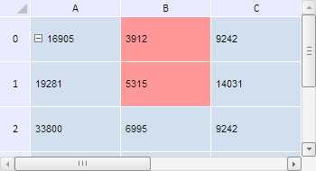

# TabSheetRange.Style

TabSheetRange.Style
-

**

# TabSheetRange.Style

## Синтаксис

Style: Object

## Описание

Свойство Style** устанавливает стиль всех ячеек диапазона.

## Комментарии

Значение свойства можно установить с помощью метода setStyle, а возвратить - с помощью метода getStyle. Из JSON значение свойства задать нельзя.

## Пример

Для выполнения примера необходимо наличие на html-странице компонента [TabSheet](../../../Components/TabSheet/TabSheet/TabSheet.htm) с наименованием «tabSheet» (см. «[Пример создания компонента TabSheet](../../../Components/TabSheet/TabSheet/TabSheet_Example.htm)»). Изменим цвет заливки ячеек в диапазоне B0-B1:

// Зададим диапазон ячеек
var range = tabSheet.getRange(1, 0, 1, 1);
// Получим стиль диапазона ячеек
var style = range.getStyle();
// Изменим цвет заливки ячеек в данном диапазоне
style.Fill.C = "#FF9999";
// Зададим новый стиль
range.setStyle(style);

В результате выполнения примера цвет заливки ячеек в диапазоне B0-B1 был изменён на розовый:

См. также:

[TabSheetRange](TabSheetRange.htm)

		Справочная
		 система на версию 10.9
		 от 18/08/2025,
		 © ООО «ФОРСАЙТ»,
