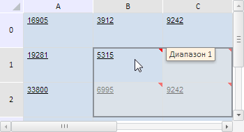
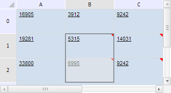

# TabSheetRange.add

TabSheetRange.add
-

**

# TabSheetRange.add

## Синтаксис

add(range: [PP.Ui.TabSheetRange](TabSheetRange.htm));

## Параметры

*range.* Диапазон ячеек
 для объединения.

## Описание

Метод add** объединяет
 указанный диапазон ячеек таблицы с текущим.

## Комментарии

Метод возвращает объект типа [TabSheetRange](TabSheetRange.htm)
 - объединённый диапазон ячеек таблицы.

## Пример

Для выполнения примера необходимо наличие на html-странице компонента
 [TabSheet](../../../Components/TabSheet/TabSheet/TabSheet.htm)
 с наименованием «tabSheet» (см. «[Пример
 создания компонента TabSheet](../../../Components/TabSheet/TabSheet/TabSheet_Example.htm)»). Определим два диапазона ячеек и объединим
 их:

// Функция для вывода координат дипазона
var wrireRangeCoord = function (range, name) {
    // Получим угловые координаты диапазона
    var coords = range.getCorners();
    console.log(name + ": (" + coords.tlCoord.rowIndex + ", " + coords.tlCoord.colIndex + ")-(" +
        coords.brCoord.rowIndex + ", " + coords.brCoord.colIndex + ")");
};
// Определим первый диапазон
var range1 = tabSheet.getRange(1, 1, 1, 2);
// Установим комментарий для созданного диапазона
range1.setComment("Диапазон 1");
this.wrireRangeCoord(range1, "Первый диапазон");
// Определим второй диапазон
var range2 = tabSheet.getRange(2, 1, 2, 2);
// Установим комментарий для него
range2.setComment("Диапазон 2");
this.wrireRangeCoord(range2, "Второй диапазон");
// Объединим два диапазона
var range3 = range1.add(range2);
this.wrireRangeCoord(range3, "Объединённый диапазон");
// Обновим объединённый диапазон
range3.reset();
// Выделим его
range3.select();

В результате выполнения примера были определены и объединены два диапазона
 ячеек. Каждой ячейке был присвоен комментарий, позволяющий идентифицировать
 принадлежность к диапазону, а объединённый диапазон был выделен:

Координаты диапазонов были выведены в консоли браузера:

Первый диапазон: (1, 1)-(2, 1)

Второй диапазон: (1, 2)-(2, 2)

Объединённый диапазон: (1, 1)-(2, 2)

Затем проверим, содержится ли второй диапазон в объединённом, эквивалентен
 ли первый диапазон разности объединённого и второго диапазонов,
 а также пересекается ли первый диапазон с объединённым:

// Проверим, содержится ли второй диапазон в объединённом
var isContains = range3.contains(range2);
console.log("Объединённый диапазон " + (isContains ? "" : "не ") + "содержит второй диапазон");
// Получим разность объединённого и второго диапазона
var subtracted = range3.subtract(range2)[0];
/* Проверим, эквивалентен ли первый диапазон
разности объединённого и второго диапазонов */
var isEquals = range1.equals(subtracted);
console.log("Первый диапазон " + (subtracted ? "" : "не ") + "эквивалентен разности объединённого и второго диапазонов");
// Проверим, пересекаются ли первый и объединённый диапазоны
if (range3.intersects(range1)) {
    // Получим область их пересечения
    var intersected = range3.getIntersectionWith(range1);
    // Выделим область пересечения
    intersected.select();
} else {
    console.log("Первый и объединённый диапазоны не пересекаются")
};

В результате выполнения примера в таблице было выделены ячейки, являющиеся
 пересечением первого и объединённого диапазонов:

В консоли браузера были выведены результаты выше указанных проверок:

Объединённый диапазон содержит второй диапазон

Первый диапазон эквивалентен разности объединённого
 и второго диапазонов

См. также:

[TabSheetRange](TabSheetRange.htm)

		Справочная
		 система на версию 10.9
		 от 18/08/2025,
		 © ООО «ФОРСАЙТ»,
