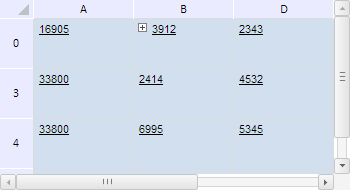
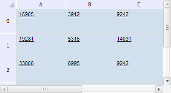

# TabSheetRange.addExpander

TabSheetRange.addExpander
-

**

# TabSheetRange.addExpander

## Синтаксис

addExpander();

## Описание

Метод addExpander** добавляет кнопку развёртывания для диапазона в его верхней левой ячейке.

## Комментарии

При свёрнутом состоянии кнопки развёртывания скрываются все ячейки диапазона, кроме ячейки, в котором находится сама кнопка.

## Пример

Для выполнения примера необходимо наличие на html-странице компонента с наименованием «tabSheet» (см. «[Пример создания компонента TabSheet](../../../Components/TabSheet/TabSheet/TabSheet_Example.htm)»). Добавим кнопку развёртывания по заданному диапазону и свернём его:

// Определим диапазон B0:C2
var range = tabSheet.getRange(1, 0, 2, 2);
// Добавим кнопку развертывания для указанного диапазона
range.addExpander();
// Получим кнопку развёртывания для диапазона
var expander = tabSheet.getExpanderUnderCoord(range.getCorners().tlCoord);
// Свернём данный диапазон
expander.collapse();

В результате выполнения примера была добавлена кнопка развёртывания по диапазону B0:C2, а сам диапазон был свёрнут:

Удалим теперь из таблицы все кнопки развёртывания:

range.removeExpanders();

После выполнения данной строки сценария кнопка развёртывания была удалена:

См. также:

[TabSheetRange](TabSheetRange.htm)

		Справочная
		 система на версию 10.9
		 от 18/08/2025,
		 © ООО «ФОРСАЙТ»,
