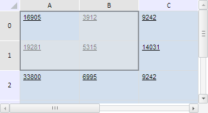

# TabSheetRange.autoExpand

TabSheetRange.autoExpand
-

**

# TabSheetRange.autoExpand

## Синтаксис

autoExpand();

## Описание

Метод autoExpand** автоматически
 расширяет диапазон ячеек таблицы.

## Комментарии

Расширение диапазона ячеек продолжается до тех пор, пока следующая строка
 или столбец не будет полностью пустыми.

## Пример

Для выполнения примера необходимо наличие на html-странице компонента
 с наименованием «tabSheet» (см. «[Пример
 создания компонента TabSheet](../../../Components/TabSheet/TabSheet/TabSheet_Example.htm)»). Создадим диапазон ячеек B0:B1, автоматически
 расширим его и выделим:

// Определим функцию для вывода координат дипазона
var wrireRangeCoord = function (range, name) {
    // Получим угловые координаты диапазона
    var coords = range.getCorners();
    console.log(name + ": (" + coords.tlCoord.rowIndex + ", " + coords.tlCoord.colIndex + ")-(" +
        coords.brCoord.rowIndex + ", " + coords.brCoord.colIndex + ")");
};
// Определим диапазон B0:B1
var range = tabSheet.getRange(1, 0, 1, 1);
this.wrireRangeCoord(range, "Координаты исходного диапазона");
// Автоматически расширим данный диапазон
range.autoExpand();
this.wrireRangeCoord(range, "Координаты расширенного диапазона");
// Выделим расширенный диапазон
range.select();

В результате выполнения примера диапазон B0:B1 был автоматически расширен
 и выделен:

В консоли браузера были выведены координаты исходного и расширенного
 диапазона:

Координаты исходного диапазона: (0, 1)-(1, 1)

Координаты расширенного диапазона: (0, 0)-(1, 1)

См. также:

[TabSheetRange](TabSheetRange.htm)

		Справочная
		 система на версию 10.9
		 от 18/08/2025,
		 © ООО «ФОРСАЙТ»,
