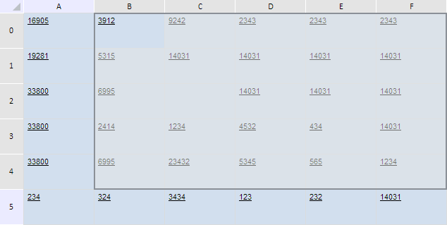

# TabSheetRange.bottomExpand

TabSheetRange.bottomExpand
-

**

# TabSheetRange.bottomExpand

## Синтаксис

bottomExpand(amount: Number, ignoreInvalid: Boolean);

## Параметры

amount. Количество строк, на которое будет выполнено расширение;

ignoreInvalid. Признак игнорирования несуществующих строк таблицы. Если параметр равен значению true, то несуществующие строки будут игнорированы, если значению false, то не будут.

## Описание

Метод bottomExpand** расширяет диапазон ячеек таблицы вниз на указанное количество строк.

## Комментарии

Метод возвращает значение типа Number - количество строк, на которое было выполнено расширение.

## Пример

Для выполнения примера необходимо наличие на html-странице компонента с наименованием «tabSheet» (см. «[Пример создания компонента TabSheet](../../../Components/TabSheet/TabSheet/TabSheet_Example.htm)»). Определим диапазон, состоящий из одной ячейки C2, и очистим значение в ней. Далее расширим данный диапазон на две строки вниз, на четыре строки вверх, на один столбец влево и на три столбца вправо:

// Определим диапазон, соответствующий одной ячейке C2
var range = tabSheet.getCell(2, 2);
// Очистим значение данной ячейки
tabSheet.setCellValue("", 2, 2)
// Расширим диапазон на две строки вниз
range.bottomExpand(2, true);
// Расширим диапазон на четыре строки вверх
range.topExpand(4, false);
// Расширим диапазон на один столбец влево
range.leftExpand(1, true);
//Расширим диапазон на три столбца вправо
range.rightExpand(3, true);
// Выделим получившийся диапазон
range.select();
// Увеличим ширину и высоту таблицы
tabSheet.setWidth(700);
tabSheet.setHeight(350);

В результате выполнения примера диапазон, состоящий из одной ячейки C2, был расширен на две строки вниз, на четыре строки вверх, на один столбец влево и на три столбца вправо. Значение исходной ячейки было стёрто, ширина таблицы изменилась до 700 пикселей, а её высота - до 350 пикселей:

См. также:

[TabSheetRange](TabSheetRange.htm)

		Справочная
		 система на версию 10.9
		 от 18/08/2025,
		 © ООО «ФОРСАЙТ»,
