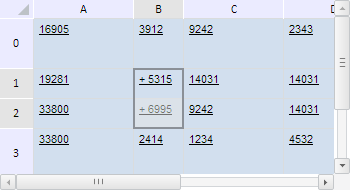

# TabSheetRange.eachCell

TabSheetRange.eachCell
-

**

# TabSheetRange.eachCell

## Синтаксис

eachCell(action: function, context: Object);

## Параметры

*action.* Функция, вызываемая для каждой
 ячейки данного диапазона;

*context.* Контекст, из которого вызван
 данный метод. Необязательный параметр, по умолчанию равен текущему контексту
 this.

## Описание

Метод eachCell** выполняет
 указанную функцию для каждой ячейки данного диапазона.

## Пример

Для выполнения примера необходимо наличие на html-странице компонента
 [TabSheet](../../../Components/TabSheet/TabSheet/TabSheet.htm)
 с наименованием «tabSheet» (см. «[Пример
 создания компонента TabSheet](../../../Components/TabSheet/TabSheet/TabSheet_Example.htm)»). Зададим диапазон ячеек B1:B2 и выделим
 его. Затем изменим ширину столбцов и высоту строк, входящих в данный диапазон,
 а также добавим символ «+» к значению всех его ячеек:

// Определим диапазон B1:B2
var range = tabSheet.getRange(1, 1, 1, 2);
// Выделим его
range.select();
// Определим функцию, которая будет выполняться для каждой ячейки в диапазоне
var forEachFunc = function (context, args) {
    // Добавим к значению каждой ячейки символ «+»
    var value = tabSheet.getModel().getCell(args).CellData.FormattedText;
    tabSheet.setCellValue("+ " + value, args.rowIndex, args.colIndex);
};
// Выполним функцию forEachFunc для всех ячеек диапазона
range.eachCell(forEachFunc, range);
// Определим функцию, которая будет выполняться для каждого столбца в диапазоне
var forEachColIndexFunc = function (context, args) {
    // Изменим ширину столбцов, входящих в заданный диапазон
    tabSheet.setColumnWidth(50, args + range.getCorners().tlCoord.colIndex);
};
// Выполним функцию forEachColIndexFunc для всех столбцов таблицы, входящих в диапазон
range.eachColIndex(forEachColIndexFunc, range, true);
// Определим функцию, которая будет выполняться для каждой строки в диапазоне
var forEachRowIndexFunc = function (context, args) {
    // Изменим высоту для каждой строки, входящей в заданный диапазон
    tabSheet.setRowHeight(30, args + range.getCorners().tlCoord.rowIndex);
};
// Выполним функцию forEachRowIndexFunc для всех строк, входящих в диапазон
range.eachRowIndex(forEachRowIndexFunc, range, true);

В результате выполнения примера был выделен диапазон ячеек B1:B2, была
 изменена ширина столбцов и высота строк, входящих в данный диапазон, а
 также добавлен символ «+» к значению всех его ячеек:

См. также:

[TabSheetRange](TabSheetRange.htm)

		Справочная
		 система на версию 10.9
		 от 18/08/2025,
		 © ООО «ФОРСАЙТ»,
