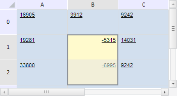

# TabSheetRange.eachCoord

TabSheetRange.eachCoord
-

**

# TabSheetRange.eachCoord

## Синтаксис

eachCoord(action: function, context: Object);

## Параметры

*action.* Функция, вызываемая для каждой
 координаты, соответствующей ячейке данного диапазона;

*context.* Контекст, из которого вызван
 данный метод. Необязательный параметр, по умолчанию равен текущему контексту
 this.

## Описание

Метод eachCoord** выполняет
 указанную функцию для каждой координаты, соответствующей ячейке данного
 диапазона.

## Пример

Для выполнения примера необходимо наличие на html-странице компонента
 [TabSheet](../../../Components/TabSheet/TabSheet/TabSheet.htm)
 с наименованием «tabSheet» (см. «[Пример
 создания компонента TabSheet](../../../Components/TabSheet/TabSheet/TabSheet_Example.htm)»). Зададим диапазон ячеек B1:B2 и выделим
 его. Затем добавим символ «-» к значению всех его ячеек, а цвет заливки
 реальных ячеек изменим на жёлтый:

// Определим диапазон B1:B2
var range = tabSheet.getRange(1, 1, 1, 2);
var model = tabSheet.getModel(); // Модель таблицы
// Выделим его
range.select();
/* Определим функцию, которая будет выполняться для каждой координаты,
входящей в диапазон */
var forEachCoordFunc = function (coord, args) {
    // Добавим к значению каждой ячейки символ «-»
    var value = tabSheet.getModel().getCell(coord).CellData.FormattedText;
    tabSheet.setCellValue("-" + value, coord.rowIndex, coord.colIndex);
};
/* Выполним функцию forEachCoordFunc для всех координат,
входящих в диапазон */
range.eachCoord(forEachCoordFunc, range);
/* Определим функцию, которая будет выполняться
для всех реальных ячеек диапазона */
var forEachRealCellFunction = function (cell, args) {
    // Получим стиль ячейки
    var style = cell.getStyle();
    style.Fill.Color = "#FFFACD"; // Жёлтый цвет заливки
    cell.setStyle(style); // Установим стиль для ячейки
    // Установим этот стиль и для ячейки таблицы
    var style = model.getStylesJSON()[0];
    var coord = cell.getCoord();
    model.setStyle(tabSheet.getCell(coord.rowIndex, coord.colIndex), style);
};
/* Выполним функцию forEachRealCellFunction для всех реальных ячеек диапазона */
range.eachRealCell(forEachRealCellFunction, range);

В результате выполнения примера был выделен диапазон B1:B2, к значению
 всех его ячеек был добавлен символ «-», а для реальных ячеек был установлён
 жёлтый цвет заливки:

См. также:

[TabSheetRange](TabSheetRange.htm)

		Справочная
		 система на версию 10.9
		 от 18/08/2025,
		 © ООО «ФОРСАЙТ»,
