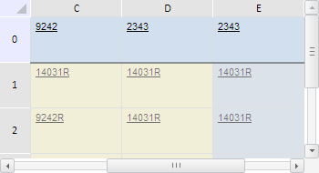

# TabSheetRange.eachVisibleCoord

TabSheetRange.eachVisibleCoord
-

**

# TabSheetRange.eachVisibleCoord

## Синтаксис

eachVisibleCoord(action: function, context: Object);

## Параметры

*action.* Функция, вызываемая для каждой
 координаты, соответствующей видимой ячейке данного диапазона;

*context.* Контекст, из которого вызван
 данный метод. Необязательный параметр, по умолчанию равен текущему контексту
 this.

## Описание

Метод eachVisibleCoord**
 выполняет указанную функцию для каждой координаты, соответствующей видимой
 ячейке данного диапазона.

## Пример

Для выполнения примера необходимо наличие на html-странице компонента
 [TabSheet](../../../Components/TabSheet/TabSheet/TabSheet.htm)
 с наименованием «tabSheet» (см. «[Пример
 создания компонента TabSheet](../../../Components/TabSheet/TabSheet/TabSheet_Example.htm)»). Зададим диапазон ячеек B1:F3 и выделим
 его. Установим для видимых ячеек диапазона жёлтый цвет заливки, а для
 всех видимых реальных ячеек добавим к значению символ «R»:

// Определим диапазон B1:F3
var range = tabSheet.getRange(1, 1, 5, 3);
var model = tabSheet.getModel(); // Модель таблицы
// Выделим его
range.select();
/* Определим действие, которое будет выполняться для
каждой координаты, соответствующей видимой ячейке в диапазоне */
var forEachVisibleCoordFunc = function (coord, args) {
    // Получим ячейку таблицы
    var cell = model.getCell(coord);
    // Получим стиль ячейки
    var style = cell.getStyle();
    style.Fill.Color = "#FFFACD"; // Жёлтый цвет заливки
    cell.setStyle(style); // Установим стиль для ячейки
    // Установим этот стиль и для ячейки таблицы
    var style = model.getStylesJSON()[0];
    model.setStyle(tabSheet.getCell(coord.rowIndex, coord.colIndex), style);
};
/* Вызовем функцию обработки координат,
соответствующих видимым ячейкам в диапазоне */
range.eachVisibleCoord(forEachVisibleCoordFunc, range);
/* Определим действие, которое будет выполняться
для каждой видимой реальной ячейки в диапазоне */
var forEachVisibleRealCoordFunc = function (cell, args) {
    // Добавим к значению каждой ячейки символ «R»
    var value = cell.CellData.FormattedText;
    var coord = cell.getCoord();
    tabSheet.setCellValue(value + "R", coord.rowIndex, coord.colIndex);
};
/* Выполним функцию forEachVisibleRealCoordFunc для
всех реальных видимых ячеек диапазона */
range.eachVisibleRealCell(forEachVisibleRealCoordFunc, range);
// Прокрутим таблицу к столбцу D
tabSheet.scrollToColumn(2);

В результате выполнения примера был выделен диапазон B1:F3, для всех
 его видимых ячеек был установлён жёлтый цвет заливки, а к значению всех
 видимых реальных ячеек был добавлен символ «R». Для наглядности примера
 таблица была прокручена горизонтально к столбцу D:

См. также:

[TabSheetRange](TabSheetRange.htm)

		Справочная
		 система на версию 10.9
		 от 18/08/2025,
		 © ООО «ФОРСАЙТ»,
