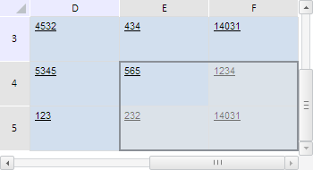

# TabSheetRange.ensureVisibility

TabSheetRange.ensureVisibility
-

**

# TabSheetRange.ensureVisibility

## Синтаксис

ensureVisibility();

## Описание

Метод ensureVisibility** автоматически прокручивает таблицу так, чтобы данный диапазон ячеек находился в видимой области.

## Пример

Для выполнения примера необходимо наличие на html-странице компонента [TabSheet](../../../Components/TabSheet/TabSheet/TabSheet.htm) с наименованием «tabSheet» (см. «[Пример создания компонента TabSheet](../../../Components/TabSheet/TabSheet/TabSheet_Example.htm)»). Определим и выделим диапазон ячеек E4:F5, находящийся в невидимой области таблицы. Затем выполним прокрутку так, чтобы он оказался видимым:

// Определим диапазон E4:F5
var range = tabSheet.getRange(4, 4, 5, 5);
// Выделим данный диапазон
range.select();
/* Если диапазон невидим, то прокрутим таблицу так,
чтобы диапазон попал в видимую область */
if (!range.isVisible()) {
    range.ensureVisibility(range);
};

В результате выполнения примера выделен диапазон ячеек E4:F5, после чего таблица была прокручена так, чтобы данный диапазон оказался в видимой области:

См. также:

[TabSheetRange](TabSheetRange.htm)

		Справочная
		 система на версию 10.9
		 от 18/08/2025,
		 © ООО «ФОРСАЙТ»,
