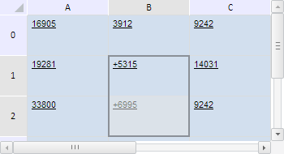

# TabSheetRange.getCells

TabSheetRange.getCells
-

**

# TabSheetRange.getCells

## Синтаксис

getCells();

## Описание

Метод getCells** возвращает массив ячеек данного диапазона.

## Комментарии

Метод возвращает массив объектов типа [PP.Ui.TabSheetCell](../TabSheetCell/TabSheetCell.htm).

## Пример

Для выполнения примера необходимо наличие на html-странице компонента [TabSheet](../../../Components/TabSheet/TabSheet/TabSheet.htm) с наименованием «tabSheet» (см. «[Пример создания компонента TabSheet](../../../Components/TabSheet/TabSheet/TabSheet_Example.htm)»). Определим диапазон B1:B2, выделим его и к значениям всех его ячеек добавим символ «+»:

// Определим диапазон B1:B2
var range = tabSheet.getRange(1, 1, 1, 2);
// Проверим валидность диапазона
var isValid = range.isValid();
if (isValid) {
    // Выделим данный диапазон
    range.select();
    // Получим массив ячеек выбранного диапазона
    var cells = range.getCells();
    for (var i = 0; i < range.getCoordsCount(); i++) {
        var cell = cells[i];
        // Добавим символ «+»
        cell.setValue("+" + cell.CellData.FormattedText);
    };
    // Обновим таблицу
    tabSheet.rerender();
};

В результате выполнения примера был выделен диапазон B1:B2, а к значениям всех его ячеек был добавлен символ «+»:

См. также:

[TabSheetRange](TabSheetRange.htm)

		Справочная
		 система на версию 10.9
		 от 18/08/2025,
		 © ООО «ФОРСАЙТ»,
