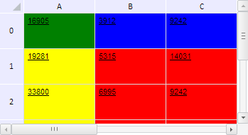

# TabSheetRange.getCutRanges

TabSheetRange.getCutRanges
-

**

# TabSheetRange.getCutRanges

## Синтаксис

getCutRanges();

## Описание

Метод getCutRanges** возвращает
 диапазоны, разъединённые линиями фиксации.

## Комментарии

Метод возвращает JSON-объект со следующими полями: tlRange - верхний
 левый, trRange - верхний правый, blRange - нижний левый и brRange - нижний
 правый диапазоны, status - [режим
 разбития](TabSheetRange.getCutStatus.htm) исходного диапазона.

## Пример

Для выполнения примера необходимо наличие на html-странице компонента
 [TabSheet](../../../Components/TabSheet/TabSheet/TabSheet.htm)
 с наименованием «tabSheet» (см. «[Пример
 создания компонента TabSheet](../../../Components/TabSheet/TabSheet/TabSheet_Example.htm)»). Определим диапазон B1:D4, зафиксируем
 первую строку и первый столбец, входящие в него. Для полученных после
 разбития линиями фиксации диапазонов установим разные цвета заливки, а
 также определим ширину и высоту диапазона из нефиксированных ячеек:

// Определим диапазон B1:D4
var range = tabSheet.getRange(0, 0, 2, 3);
// Определим функцию для заливки ячеек таблицы
var fill = function (range, color) {
    // Получим массив ячеек в диапазоне
    var cells = range.getCells();
    for (var i in cells) {
        // Получим отдельную ячейку
        var cell = cells[i];
        // Получим стиль ячейки
        var style = cell.getStyle();
        style.Fill.Color = color; // Цвет заливки
        cell.setStyle(style); // Установим стиль для ячейки
        // Установим этот стиль и для ячейки таблицы
        var style = tabSheet.getModel().getStylesJSON()[0];
        var coord = cell.getCoord();
        range.getTabSheet().getModel().setStyle(tabSheet.getCell(coord.rowIndex, coord.colIndex), style);
    }
};
// Зафиксируем первую строку и первый столбец, входящие в данный диапазон
tabSheet.setFixedColumn(0);
tabSheet.setFixedRow(0);
// Определим, пересекают ли диапазон линии фиксации
var isCuttedRange = range.isCuttedRange();
if (isCuttedRange) {
    // Получим диапазоны, разъединённые фиксированными строками и столбцами
    var cutRanges = range.getCutRanges();
    // Выполним заливку получившихся диапазонов разными цветами
    if (range.getCutStatus() === "tblr") {
        this.fill(cutRanges.blRange, "yellow");
        this.fill(cutRanges.brRange, "red");
        this.fill(cutRanges.tlRange, "green");
        this.fill(cutRanges.trRange, "blue");
    }
    // Определим размеры получившихся диапазонов
    var cutRangeSizes = range.getCutRangeSizes();
    /* Определим ширину и высоту диапазона из нефиксировнных ячеек */
    console.log("Ширина диапазона из нефиксированных ячеек: " + cutRangeSizes.brSize.width);
    console.log("Его высота: " + cutRangeSizes.brSize.height);
};

В результате выполнения примера были зафиксированы первые строка и столбец,
 входящие в диапазон B1:D4. Для полученных после разбития линиями фиксации
 диапазонов были установлены жёлтый, красный, зелёный и синий цвета заливки:

В консоли браузера были выведены ширина и высота диапазона, состоящего
 из нефиксированных ячеек:

Ширина диапазона из нефиксированных ячеек: 200

Его высота: 150

См. также:

[TabSheetRange](TabSheetRange.htm)

		Справочная
		 система на версию 10.9
		 от 18/08/2025,
		 © ООО «ФОРСАЙТ»,
