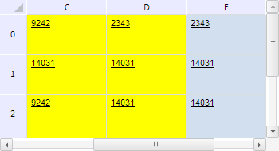

# TabSheetRange.getVisibleRange

TabSheetRange.getVisibleRange
-

**

# TabSheetRange.getVisibleRange

## Синтаксис

getVisibleRange();

## Описание

Метод getVisibleRange**
 возвращает диапазон видимых ячеек, входящих в данный диапазон.

## Комментарии

Метод возвращает объект типа [PP.Ui.TabSheetRange](TabSheetRange.htm).

## Пример

Для выполнения примера необходимо наличие на html-странице компонента
 [TabSheet](../../../Components/TabSheet/TabSheet/TabSheet.htm)
 с наименованием «tabSheet» (см. «[Пример
 создания компонента TabSheet](../../../Components/TabSheet/TabSheet/TabSheet_Example.htm)»). Определим диапазон, охватывающий всю
 таблицу, его видимые ячейки окрасим в жёлтый цвет и заблокируем:

// Получим измерения таблицы
var measures = tabSheet.getMeasures();
// Определим индекс последней строки таблицы
var lastColIndex = measures.getLastColIndex();
// Определим индекс последнего столбца таблицы
var lastRowIndex = measures.getLastRowIndex();
// Определим диапазон, охыватывающий всю таблицу
var range = tabSheet.getRange(0, 0, lastColIndex, lastRowIndex);
// Определим функцию для заливки ячеек таблицы
var fill = function (range, color) {
    // Получим массив ячеек в диапазоне
    var cells = range.getCells();
    for (var i in cells) {
        // Получим отдельную ячейку
        var cell = cells[i];
        // Получим стиль ячейки
        var style = cell.getStyle();
        style.Fill.Color = color; // Цвет заливки
        cell.setStyle(style); // Установим стиль для ячейки
        // Установим этот стиль и для ячейки таблицы
        var style = tabSheet.getModel().getStylesJSON()[0];
        var coord = cell.getCoord();
        range.getTabSheet().getModel().setStyle(tabSheet.getCell(coord.rowIndex, coord.colIndex), style);
    }
};
// Проверим, полностью ли скрыт данный диапазон
if (!range.isWholeHidden()) {
    // Получим диапазон видимых ячеек
    var visibleRange = range.getVisibleRange();
    // Установим жёлтый цвет заливки для видимого диапазона
    this.fill(visibleRange, PP.Color.Colors.yellow);
    // Заблокируем ячейки видимого диапазона
    visibleRange.setEnabled(false);
};
// Прокрутим таблицу к столбцу D
tabSheet.scrollToColumn(2);

В результате выполнения примера был определён диапазон, охватывающий
 всю таблицу, его видимые ячейки были окрашены в жёлтый цвет и заблокированы.
 Так ячейки, окрашенные в жёлтый цвет, теперь не доступны для редактирования,
 остальные - доступны. Для наглядности примера была выполнена прокрутка
 таблицы к столбцу D:

См. также:

[TabSheetRange](TabSheetRange.htm)

		Справочная
		 система на версию 10.9
		 от 18/08/2025,
		 © ООО «ФОРСАЙТ»,
