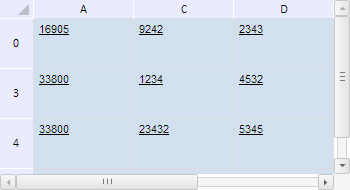

# TabSheetRange.isAllColumnsHidden

TabSheetRange.isAllColumnsHidden
-

**

# TabSheetRange.isAllColumnsHidden

## Синтаксис

isAllColumnsHidden();

## Описание

Метод isAllColumnsHidden**
 определяет, скрыты ли все столбцы данного диапазона.

## Комментарии

Метод возвращает значение true,
 если все столбцы данного диапазона скрыты, и значение false,
 если хотя бы один столбец не скрыт.

## Пример

Для выполнения примера необходимо наличие на html-странице компонента
 с наименованием «tabSheet» (см. «[Пример
 создания компонента TabSheet](../../../Components/TabSheet/TabSheet/TabSheet_Example.htm)»). Определим диапазон B1:B2 и скроем
 все входящие в него столбцы и строки:

// Определим диапазон B1:B2
var range = tabSheet.getRange(1, 1, 1, 2);
// Определим координаты угловых ячеек диапазона
var coords = range.getCorners();
console.log("Исходный диапазон: (" + coords.tlCoord.rowIndex + ", " + coords.tlCoord.colIndex + ")-(" +
    coords.brCoord.rowIndex + ", " + coords.brCoord.colIndex + ")");
// Скроем все столбцы диапазона
tabSheet.hideColumns(coords.tlCoord.colIndex, coords.trCoord.colIndex - coords.tlCoord.colIndex + 1);
// Проверим, скрыты ли все столбцы, входящие в диапазон
if (range.isAllColumnsHidden()) {
    console.log("Все входящие в диапазон столбцы скрыты")
} else {
    console.log("Не все входящие в диапазон столбцы скрыты")
};
// Скроем теперь все строки, входящие в диапазон
tabSheet.hideRows(coords.tlCoord.rowIndex, coords.blCoord.rowIndex - coords.tlCoord.rowIndex + 1);
//Проверим, скрыты ли все строки, содержащиеся в range
if (range.isAllRowsHidden()) {
    console.log("Все входящие в диапазон строки скрыты")
} else {
    console.log("Не все входящие в диапазон строки скрыты")
};

В результате выполнения примера все входящие в диапазон B1:B2 столбцы
 и строки были скрыты:

В консоли браузера были выведены координаты диапазона и сообщения, скрыты
 ли всего входящие в него столбцы и строки:

Исходный диапазон: (1, 1)-(2, 1)

Все входящие в диапазон столбцы скрыты

Все входящие в диапазон строки скрыты

См. также:

[TabSheetRange](TabSheetRange.htm)

		Справочная
		 система на версию 10.9
		 от 18/08/2025,
		 © ООО «ФОРСАЙТ»,
