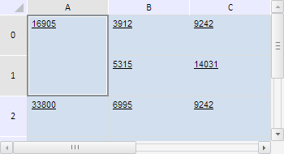
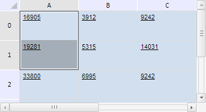

# TabSheetRange.merge

TabSheetRange.merge
-

**

# TabSheetRange.merge

## Синтаксис

merge();

## Описание

Метод merge** объединяет
 ячейки таблицы в данном диапазоне.

## Пример

Для выполнения примера необходимо наличие на html-странице компонента
 [TabSheet](../../../Components/TabSheet/TabSheet/TabSheet.htm)
 с наименованием «tabSheet» (см. «[Пример
 создания компонента TabSheet](../../../Components/TabSheet/TabSheet/TabSheet_Example.htm)»). Объединим ячейки в диапазоне A0:A1,
 затем выделим полученное объединение и определим его размер:

// Определим диапазон ячеек A0:A1
var range = tabSheet.getRange(0, 0, 0, 1);
/* Определим функцию для определения размера
диапазона объединённых ячеек */
var defineSpanSize = function (targetRange) {
    // Получим объединения ячеек, пападающие в диапазон
    var spans = targetRange.getInnerSpans();
    if (spans.length > 0) {
        console.log("Количество охватываемых строк: " + spans[0].rowCount);
        console.log("Количество охватываемых столбцов: " + spans[0].colCount);
    } else {
        console.log("Диапазоны объединённых ячеек отсутствуют.");
    }
}
// Объединим ячейки в данном диапазоне
range.merge();
// Выделим объединение
range.select();
// Определим размеры объединённого диапазона
this.defineSpanSize(range);

В результате выполнения примера были объединены и выделены ячейки в
 диапазоне A0:A1:

В консоли браузера были выведены размеры объединённого диапазона, выраженные
 в количестве охватываемых им строк и столбцов таблицы:

Количество охватываемых строк: 2

Количество охватываемых столбцов: 1

Теперь разъединим ячейки в рассматриваемом диапазоне:

range.split();
// Проверим наличие объединённых ячеек
this.defineSpanSize(range);
После выполнения данного сценария ячейки в диапазоне A0:A1 были разъединены:

В консоли браузера было выведено уведомление о том, что диапазоны объединённых
 ячеек отсутствуют.

См. также:

[TabSheetRange](TabSheetRange.htm)

		Справочная
		 система на версию 10.9
		 от 18/08/2025,
		 © ООО «ФОРСАЙТ»,
