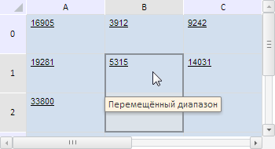

# TabSheetRange.shift

TabSheetRange.shift
-

**

# TabSheetRange.shift

## Синтаксис

shift(rows: Number, columns: Number);

## Параметры

rows. Количество строк, на которое сдвигается данный диапазон;

columns. Количество столбцов, на которое сдвигается данный диапазон.

## Описание

Метод shift** сдвигает данный диапазон ячеек на указанное количество строк и столбцов.

## Пример

Для выполнения примера необходимо наличие на html-странице компонента [TabSheet](../../../Components/TabSheet/TabSheet/TabSheet.htm) с наименованием «tabSheet» (см. «[Пример создания компонента TabSheet](../../../Components/TabSheet/TabSheet/TabSheet_Example.htm)»). Сдвинем диапазон A0:A1 на одну строку вниз и на один столбец вправо:

// Определим диапазон A0:A1
var range = tabSheet.getRange(0, 0, 0, 1);
// Переместим диапазон на один столбец вправо и на одну строку вниз
range.shift(1, 1);
//Установим подсказку для каждой ячейки в диапазоне
range.setHint("Перемещённый диапазон");
// Выделим данный диапазон
range.select();

В результате выполнения примера диапазон A0:A1 был выделен и сдвинут на одну строку вниз и на один столбец вправо. При наведении указателя мыши на данный диапазон отображается всплывающая подсказка «Перемещённый диапазон»:

См. также:

[TabSheetRange](TabSheetRange.htm)

		Справочная
		 система на версию 10.9
		 от 18/08/2025,
		 © ООО «ФОРСАЙТ»,
