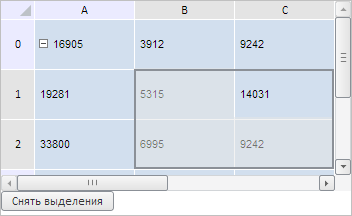
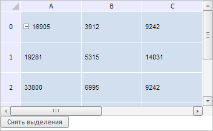

# TabSheetSelection.addRange

TabSheetSelection.addRange
-

**

# TabSheetSelection.addRange

## Синтаксис

addRange(range: [PP.Ui.TabSheetRange](../TabSheetRange/TabSheetRange.htm),
 startCoord: [PP.Ui.TabSheetCoord](../TabSheetCoord/TabSheetCoord.htm),
 modifyActive: Boolean, areaType: [PP.Ui.TabSheetSelectionAreaType](../../../Enums/TabSheetSelectionAreaType.htm),
 noRerender: Boolean, fireEvent: Boolean);

## Параметры

*range.* Определяет диапазон выделения
 в таблице;

*startCoord.* Определяет начальную
 координату выделения;

*modifyActive.* Признак дополнительного
 выделения (если равен значению true, то новое выделение будет добавлено к
 существующему, если false, то старое выделение будет сброшено);

*areaType.*
 Определяет тип области выделения;

*fireEvent.*
 Определяет, генерировать ли событие выделения. Если параметр равен значению
 true, то данное событие будет
 сгенерировано, иначе - не будет;

*noRerender.*
 Определяет, нужно ли перерисовывать таблицу. Если параметр равен значению
 true, то таблица будет перерисована,
 иначе - не будет.

## Описание

Метод addRange** создает
 новую область выделения по заданному диапазону ячеек.

## Пример

Для выполнения примера необходимо наличие на html-странице компонента
 [TabSheet](../../../Components/TabSheet/TabSheet/TabSheet.htm)
 с наименованием «tabSheet» (см. «[Пример
 создания компонента TabSheet](../../../Components/TabSheet/TabSheet/TabSheet_Example.htm)»). Выделим диапазон ячеек B1-C2 и добавим
 кнопку для снятия выделенных областей в таблице:

// Получим объект выделения
var objSelection = tabSheet.getSelection();
// Получим диапазон ячеек по заданным координатам
var range = tabSheet.getRange(1, 2, 2, 1);
// Зададим начальные координаты выделения
var startCoord = tabSheet.coord(1, 2);
// Создадим новую область выделения по заданному диапазону ячеек
objSelection.addRange(range, startCoord, false);
// Добавим кнопку, очищающую выделение в таблице
var clearButton = new PP.Ui.Button({
    ParentNode: document.body,
    Id: "clearButton",
    ResourceKey: "clearButton",
    Content: "Снять выделения",
    Click: function btnOnClick() {
        objSelection.clear();
    }
});

В результате выполнения примера был выделен диапазон ячеек B1-C2, а
 также добавлена кнопка для снятия всех выделенных областей в таблице:

После нажатия на данную кнопку выделение в таблице будет снято:

См. также:

[TabSheetSelection](TabSheetSelection.htm)

		Справочная
		 система на версию 10.9
		 от 18/08/2025,
		 © ООО «ФОРСАЙТ»,
