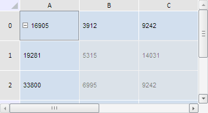

# TabSheetSelection.eachSelectedArea

TabSheetSelection.eachSelectedArea
-

**

# TabSheetSelection.eachSelectedArea

## Синтаксис

eachSelectedArea(action: function, context: Object);

## Параметры

*action. *Функция, которую нужно выполнить над каждой выделенной областью в таблице;

*context.* Контекст, из которого вызван данный метод.

## Описание

Метод eachSelectedArea** выполняет указанную функцию для каждой выделенной области.

## Пример

Для выполнения примера необходимо наличие на html-странице компонента [TabSheet](../../../Components/TabSheet/TabSheet/TabSheet.htm) с наименованием «tabSheet» (см. «[Пример создания компонента TabSheet](../../../Components/TabSheet/TabSheet/TabSheet_Example.htm)»). Выделим в таблице ячейку A0 и диапазон B1-C2, а затем определим количество ячеек в каждой области выделения:

// Создадим функцию, определяющую количество ячеек в области выделения
var eachSelectionAction = function (area) {
    // Получим диапазон из указанной выделенной области
    var range = area.Range;
    // Получим количество ячеек в этой области
    var count = range.getCoordsCount();
    console.log("Количество ячеек в выделенной области: " + count)
}
// Получим объект выделения
var objSelection = tabSheet.getSelection();
// Выделим два диапазона ячеек
objSelection.select(tabSheet.getRange(1, 2, 2, 1), false, tabSheet.coord(1, 2));
objSelection.select(tabSheet.getRange(0, 0, 0, 0), true, tabSheet.coord(0, 0));
// Изменим объект выделения так, чтобы он гарантированно существовал
objSelection.ensureExistence();
// Определим количество ячеек во всех выделенных областях таблицы
objSelection.eachSelectedArea(eachSelectionAction, objSelection);

В результате выполнения примера в таблице были одновременно выделены ячейка A0 и диапазон B1-C2:

Также в консоли браузера было выведено количество ячеек во всех выделенных областях таблицы:

Количество ячеек в выделенной области: 4

Количество ячеек в выделенной области: 1

См. также:

[TabSheetSelection](TabSheetSelection.htm)

		Справочная
		 система на версию 10.9
		 от 18/08/2025,
		 © ООО «ФОРСАЙТ»,
