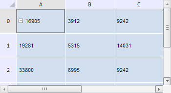

# TabSheetSelection.ensureExistence

TabSheetSelection.ensureExistence
-

**

# TabSheetSelection.ensureExistence

## Синтаксис

ensureExistence();

## Описание

Метод ensureExistence** изменяет объект выделения таким образом, чтобы он гарантированно существовал.

## Пример

Для выполнения примера необходимо наличие на html-странице компонента [TabSheet](../../../Components/TabSheet/TabSheet/TabSheet.htm) с наименованием «tabSheet» (см. «[Пример создания компонента TabSheet](../../../Components/TabSheet/TabSheet/TabSheet_Example.htm)»). Обеспечим гарантированное существования объекта выделения:

// Получаем объект выделения
var objSelection = tabSheet.getSelection();
// Снимем все выделения в таблице
objSelection.clear();
// Убедимся, что объект выделения существует
objSelection.ensureExistence();

В результате выполнения примера будет выделена ячейка A0:

См. также:

[TabSheetSelection](TabSheetSelection.htm)

		Справочная
		 система на версию 10.9
		 от 18/08/2025,
		 © ООО «ФОРСАЙТ»,
