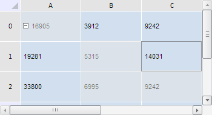
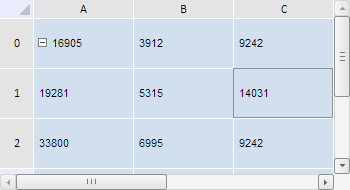

# TabSheetSelection.getSelectedAreas

TabSheetSelection.getSelectedAreas
-

**

# TabSheetSelection.getSelectedAreas

## Синтаксис

getSelectedAreas();

## Описание

Метод getSelectedAreas**
 возвращает массив выделенных в таблице областей.

## Комментарии

Метод возвращает массив JSON-объектов со следующими полями: Nodes -
 массив вершин html-документа, Range - диапазон ячеек в выделенной области
 таблицы, Type - тип выделенной области (равен элементу перечисления [PP.Ui.TabSheetSelectionAreaType](../../../Enums/TabSheetSelectionAreaType.htm)).

## Пример

Для выполнения примера необходимо наличие на html-странице компонента
 [TabSheet](../../../Components/TabSheet/TabSheet/TabSheet.htm)
 с наименованием «tabSheet» (см. «[Пример
 создания компонента TabSheet](../../../Components/TabSheet/TabSheet/TabSheet_Example.htm)»). Выделим в таблице ячейку A0 и диапазон
 B1-C2, а затем обратно уберём выделенные области:

// Получим объект выделения
var objSelection = tabSheet.getSelection();
// Выделим два диапазона ячеек
objSelection.select(tabSheet.getRange(0, 0, 0, 0), false, tabSheet.coord(0, 0));
objSelection.select(tabSheet.getRange(1, 2, 2, 1), true, tabSheet.coord(1, 2));
var isRemoveAreas = confirm("Убрать все выделенные области?");
if (isRemoveAreas) {
    // Получим выделенные области таблицы
    var selectedAreas = objSelection.getSelectedAreas();
    for (var i in selectedAreas) {
        var area = selectedAreas[i];
        // Удалим выделенную область
        objSelection.removeArea(area)
    }
};

В результате выполнения примера в таблице были одновременно выделены
 ячейка A0 и диапазон B1-C2:

После этого был показан диалог, запрашивающий подтверждение на удаление
 выделенных областей таблицы. В результате нажатия кнопки «OK» все выделенные
 области были убраны:

См. также:

[TabSheetSelection](TabSheetSelection.htm)

		Справочная
		 система на версию 10.9
		 от 18/08/2025,
		 © ООО «ФОРСАЙТ»,
