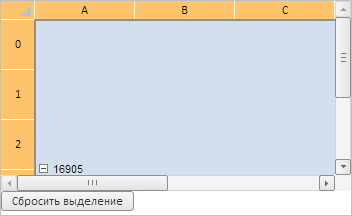
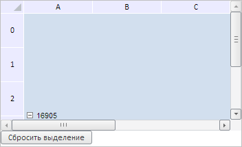

# TabSheetSelection.selectAll

TabSheetSelection.selectAll
-

**

# TabSheetSelection.selectAll

## Синтаксис

selectAll(fireEvent: Boolean);

## Параметры

*fireEvent. Определяет, генерировать ли событие выделения*. Если параметр равен значению true, то данное событие будет сгенерировано, иначе - не будет. Необязательный параметр, по умолчанию равен true.

## Описание

Метод selectAll** выделяет всю таблицу.

## Пример

Для выполнения примера необходимо наличие на html-странице компонента [TabSheet](../../../Components/TabSheet/TabSheet/TabSheet.htm) с наименованием «tabSheet» (см. «[Пример создания компонента TabSheet](../../../Components/TabSheet/TabSheet/TabSheet_Example.htm)»). Выделим всю таблицу, далее определим тип и начальную координату текущего выделения, объединим все выделенные ячейки и добавим кнопку для сброса данного выделения:

// Получаем объект выделения
var objSelection = tabSheet.getSelection();
// Выделим всю таблицу
objSelection.selectAll();
// Определим тип выделения
var selectionType = objSelection.getSelectionType();
console.log("Тип текущего выделения: " + selectionType);
// Определим начальную координату выделения
var startCoord = objSelection.getStartCoord();
console.log("Начальная координата выделения: " + startCoord);
// Получим диапазон выделенных ячеек
var range = objSelection.getRange();
// Объединим все ячейки диапазона выделенных ячеек
objSelection.getTabSheet().merge(range);
// Добавим кнопку для сброса выделения
var resetSelection = new PP.Ui.Button({
    ParentNode: document.body,
    Id: "resetSelection",
    ResourceKey: "resetSelection",
    Content: "Сбросить выделение",
    Click: function btnOnClick() {
        objSelection.reset()
    }
});

В результате выполнения примера была выделена вся таблица и добавлена кнопка для сброса данного выделения, при этом все ячейки в таблице были объединены:

Также в консоли браузера были выведены тип и начальная координата текущего выделения:

Тип текущего выделения: Table

Начальная координата выделения: (0, 0)

После нажатия на кнопку выделение в таблице будет сброшено:

См. также:

[TabSheetSelection](TabSheetSelection.htm)

		Справочная
		 система на версию 10.9
		 от 18/08/2025,
		 © ООО «ФОРСАЙТ»,
