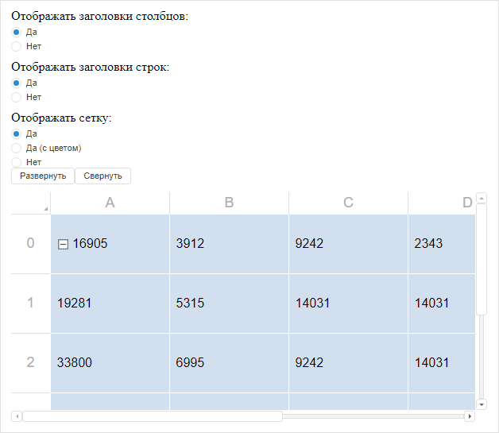

# Пример создания компонента TabSheet

Пример создания компонента TabSheet
-

# Пример создания компонента TabSheet

Перед выполнением примера ознакомьтесь с [рекомендациями](dhtml.chm::/specification/JavaScript_main.htm)
 к написанию кода.

Для выполнения примера:

	- Создайте файлы:

[SyncDataSource.js](javascript:TextPopup(this))

	Файл SyncDataSource.js содержит описание
	 класса PP.Ui.ExampleAsyncDataSource,
	 представляющего собой асинхронный источник данных для таблицы.

	Содержимое файла:

// Создаём асинхронный источник данных для таблицы
PP.Ui.ExampleAsyncDataSource = function () {
    this.MeasuresLoaded = new PP.Delegate();
    this.RangeLoaded = new PP.Delegate();
};
// Инициализиуем класс
PP.initClass(PP.Ui.ExampleAsyncDataSource, PP.Object, "PP.Ui.ExampleAsyncDataSource", [PP.Ui.ISource]);
// Создаём объект асинхронного источника данных для таблицы
var eadsProto = PP.Ui.ExampleAsyncDataSource.prototype;
eadsProto._isAsync = false;
/// 

/// Возвращаем признак того, является ли источник данных асинхронным
/// 

eadsProto.getIsAsync = function () {
    return this._isAsync
};
/// 

/// Устанавливаем, является ли источник данных асинхронным
/// 

eadsProto.setIsAsync = function (value) {
    this._isAsync = value
};
/// 

/// Загрузить метаданные таблицы
/// 

eadsProto._getData = function () {
    return metadata
};
/// 

/// Загрузить измерения таблицы
/// 

eadsProto.loadMeasures = function () {
    var self = this;
    setTimeout(function () {
        if (self._IsDisposed) {
            return
        }
        self.MeasuresLoaded.fire(self, {
            Data: self._getData()
        });
    }, 200);
};
/// 

/// Загрузить диапазоны ячеек таблицы
/// 

/// <param name="rangeArray" type="PP.Ui.TabSheetRange">Массив загружаемых диапазонов</param>
eadsProto.loadRanges = function (rangeArray) {
    var self = this;
    setTimeout(function () {
        if (self._IsDisposed) {
            return;
        }
        var tabSheetData = self._getData(),
            range, corners,
            cells = tabSheetData.Cells ? tabSheetData.Cells.Cell : null,
            cellsCount = (cells !== null ? cells.length : 0),
            i, cell, j,
            topRow, bottomRow,
            leftColumn, rightColumn,
            filteredCells = [];
        for (i = 0; i < rangeArray.length; i++) {
            range = rangeArray[i];
            corners = range.getCorners();
            topRow = corners.tlCoord.rowIndex;
            bottomRow = corners.blCoord.rowIndex;
            leftColumn = corners.tlCoord.colIndex;
            rightColumn = corners.trCoord.colIndex;
            for (j = 0; j < cellsCount; j++) {
                cell = cells[j];
                if (cell["@L"] >= leftColumn && cell["@L"] <= rightColumn && cell["@T"] >= topRow && cell["@T"] <= bottomRow) {
                    filteredCells.push(cell);
                }
            }
        }
        self.RangeLoaded.fire(self, {
            Data: {
                Version: tabSheetData.Version,
                Structure: tabSheetData.Structure,
                Cells: {
                    Cell: filteredCells
                },
                Styles: tabSheetData.Styles
            },
            Ranges: rangeArray
        });
    }, 400);
};
/// 

/// Загружаем данные в таблицу
/// 

/// <param name="rangeArray" type="PP.Ui.TabSheetRange">Массив загружаемых диапазонов с данными</param>
eadsProto.loadSyncData = function (rangeArray) {
    var tabSheetData = this._getData(),
        range, corners,
        cells = tabSheetData.Cells ? tabSheetData.Cells.Cell : null,
        cellsCount = (cells !== null ? cells.length : 0),
        i, cell, j,
        topRow, bottomRow,
        leftColumn, rightColumn,
        filteredCells = [];
    for (i = 0; i < rangeArray.length; i++) {
        range = rangeArray[i];
        corners = range.getCorners();
        topRow = corners.tlCoord.rowIndex;
        bottomRow = corners.blCoord.rowIndex;
        leftColumn = corners.tlCoord.colIndex;
        rightColumn = corners.trCoord.colIndex;
        for (j = 0; j < cellsCount; j++) {
            cell = cells[j];
            if (cell["@L"] >= leftColumn && cell["@L"] <= rightColumn && cell["@T"] >= topRow && cell["@T"] <= bottomRow) {
                filteredCells.push(cell);
            }
        }
    }
    return [{
        Cells: {
            Cell: filteredCells
        }
    }];
};
eadsProto = null;

[Expanders.js](javascript:TextPopup(this))

	Файл Expanders.js содержит переменную,
	 которой присвоен [JSON-объект](TabSheet_JSON.htm) со значениями
	 свойств таблицы и данных её ячеек.

	Содержимое файла:

// Определим данные ячеек таблицы
var metadata = {
    "@Version": 80,
    "Structure": {
        "@MC": 6,
        "@MUR": 5,
        "@DRN": true,
        "@MUC": 5,
        "@DAR": true,
        "@DCN": true,
        "@FR": -1,
        "@FC": -1,
        "@DG": true,
        "@MR": 22,
        "DefaultRow": {
            "@H": 50
        },
        "DefaultColumn": {
            "@W": 100
        },
        "Rows": {
            "Row": []
        },
        "Columns": {
            "Column": []
        },
        "CellSpans": {
            "CellSpan": []
        },
        "Expanders": {
            "Expander": [{
                "@L": 0,
                "@T": 0,
                "@W": 1,
                "@H": 1,
                "@IC": false
            }]
        },
        "Objects": ""
    },
    "Cells": {
        "Cell": [{
            "@T": "0",
            "@L": "0",
            "@SI": "0",
            "CD": {
                "@V": "0",
                "@FT": "16905",
                "@IE": "true"
            }
        }, {
            "@T": "0",
            "@L": "1",
            "@SI": "0",
            "CD": {
                "@V": "",
                "@FT": "3912",
                "@IE": "true"
            }
        }, {
            "@T": "0",
            "@L": "2",
            "@SI": "0",
            "CD": {
                "@V": "",
                "@FT": "9242",
                "@IE": "true"
            }
        }, {
            "@T": "0",
            "@L": "3",
            "@SI": "0",
            "CD": {
                "@V": "",
                "@FT": "2343",
                "@IE": "true"
            }
        }, {
            "@T": "0",
            "@L": "4",
            "@SI": "0",
            "CD": {
                "@V": "",
                "@FT": "2343",
                "@IE": "true"
            }
        }, {
            "@T": "0",
            "@L": "5",
            "@SI": "0",
            "CD": {
                "@V": "",
                "@FT": "2343",
                "@IE": "true"
            }
        }, {
            "@T": "1",
            "@L": "0",
            "@SI": "0",
            "CD": {
                "@V": "",
                "@FT": "19281",
                "@IE": "true"
            }
        }, {
            "@T": "1",
            "@L": "1",
            "@SI": "0",
            "CD": {
                "@V": "",
                "@FT": "5315",
                "@IE": "true"
            }
        }, {
            "@T": "1",
            "@L": "2",
            "@SI": "0",
            "CD": {
                "@V": "",
                "@FT": "14031",
                "@IE": "true"
            }
        }, {
            "@T": "1",
            "@L": "3",
            "@SI": "0",
            "CD": {
                "@V": "",
                "@FT": "14031",
                "@IE": "true"
            }
        }, {
            "@T": "1",
            "@L": "4",
            "@SI": "0",
            "CD": {
                "@V": "",
                "@FT": "14031",
                "@IE": "true"
            }
        }, {
            "@T": "1",
            "@L": "5",
            "@SI": "0",
            "CD": {
                "@V": "",
                "@FT": "14031",
                "@IE": "true"
            }
        }, {
            "@T": "2",
            "@L": "0",
            "@SI": "0",
            "CD": {
                "@V": "",
                "@FT": "33800",
                "@IE": "true"
            }
        }, {
            "@T": "2",
            "@L": "1",
            "@SI": "0",
            "CD": {
                "@V": "",
                "@FT": "6995",
                "@IE": "true"
            }
        }, {
            "@T": "2",
            "@L": "2",
            "@SI": "0",
            "CD": {
                "@V": "",
                "@FT": "9242",
                "@IE": "true"
            }
        }, {
            "@T": "2",
            "@L": "3",
            "@SI": "0",
            "CD": {
                "@V": "",
                "@FT": "14031",
                "@IE": "true"
            }
        }, {
            "@T": "2",
            "@L": "4",
            "@SI": "0",
            "CD": {
                "@V": "",
                "@FT": "14031",
                "@IE": "true"
            }
        }, {
            "@T": "2",
            "@L": "5",
            "@SI": "0",
            "CD": {
                "@V": "",
                "@FT": "14031",
                "@IE": "true"
            }
        }, {
            "@T": "3",
            "@L": "0",
            "@SI": "0",
            "CD": {
                "@V": "",
                "@FT": "33800",
                "@IE": "true"
            }
        }, {
            "@T": "3",
            "@L": "1",
            "@SI": "0",
            "CD": {
                "@V": "",
                "@FT": "2414",
                "@IE": "true"
            }
        }, {
            "@T": "3",
            "@L": "2",
            "@SI": "0",
            "CD": {
                "@V": "",
                "@FT": "1234",
                "@IE": "true"
            }
        }, {
            "@T": "3",
            "@L": "3",
            "@SI": "0",
            "CD": {
                "@V": "",
                "@FT": "4532",
                "@IE": "true"
            }
        }, {
            "@T": "3",
            "@L": "4",
            "@SI": "0",
            "CD": {
                "@V": "",
                "@FT": "434",
                "@IE": "true"
            }
        }, {
            "@T": "3",
            "@L": "5",
            "@SI": "0",
            "CD": {
                "@V": "",
                "@FT": "14031",
                "@IE": "true"
            }
        }, {
            "@T": "4",
            "@L": "0",
            "@SI": "0",
            "CD": {
                "@V": "",
                "@FT": "33800",
                "@IE": "true"
            }
        }, {
            "@T": "4",
            "@L": "1",
            "@SI": "0",
            "CD": {
                "@V": "",
                "@FT": "6995",
                "@IE": "true"
            }
        }, {
            "@T": "4",
            "@L": "2",
            "@SI": "0",
            "CD": {
                "@V": "",
                "@FT": "23432",
                "@IE": "true"
            }
        }, {
            "@T": "4",
            "@L": "3",
            "@SI": "0",
            "CD": {
                "@V": "",
                "@FT": "5345",
                "@IE": "true"
            }
        }, {
            "@T": "4",
            "@L": "4",
            "@SI": "0",
            "CD": {
                "@V": "",
                "@FT": "565",
                "@IE": "true"
            }
        }, {
            "@T": "4",
            "@L": "5",
            "@SI": "0",
            "CD": {
                "@V": "",
                "@FT": "1234",
                "@IE": "true"
            }
        }, {
            "@T": "5",
            "@L": "0",
            "@SI": "0",
            "CD": {
                "@V": "",
                "@FT": "234",
                "@IE": "true"
            }
        }, {
            "@T": "5",
            "@L": "1",
            "@SI": "0",
            "CD": {
                "@V": "",
                "@FT": "324",
                "@IE": "true"
            }
        }, {
            "@T": "5",
            "@L": "2",
            "@SI": "0",
            "CD": {
                "@V": "",
                "@FT": "3434",
                "@IE": "true"
            }
        }, {
            "@T": "5",
            "@L": "3",
            "@SI": "0",
            "CD": {
                "@V": "",
                "@FT": "123",
                "@IE": "true"
            }
        }, {
            "@T": "5",
            "@L": "4",
            "@SI": "0",
            "CD": {
                "@V": "",
                "@FT": "232",
                "@IE": "true"
            }
        }, {
            "@T": "5",
            "@L": "5",
            "@SI": "0",
            "CD": {
                "@V": "",
                "@FT": "14031",
                "@IE": "true"
            }
        }]
    },
    "Styles": {
        "Style": [{
            "@B": "",
            "@AR": "3",
            "Text": {
                "@VA": 1,
                "@HA": 1,
                "@M": "5 5 5 5",
                "@WW": 1
            },
            "NumberFormat": {
                "@F": ""
            },
            "Fill": {
                "@C": "#D2DFEE"
            },
            "Font": {
                "@A": "0",
                "@B": "false",
                "@S": 10.67,
                "@C": "#000000",
                "@U": "false",
                "@F": "Arial",
                "@I": "false"
            },
            "Borders": {
                "Border": [{
                    "@S": 7,
                    "@C": "#000000",
                    "@W": 2,
                    "@I": 0
                }, {
                    "@S": 7,
                    "@C": "#000000",
                    "@W": 2,
                    "@I": 1
                }, {
                    "@S": 0,
                    "@C": "#FFFFFF",
                    "@W": 2,
                    "@I": 2
                }, {
                    "@S": 0,
                    "@C": "#FFFFFF",
                    "@W": 2,
                    "@I": 3
                }, {
                    "@S": 0,
                    "@C": "#FFFFFF",
                    "@W": 2,
                    "@I": 4
                }, {
                    "@S": 0,
                    "@C": "#FFFFFF",
                    "@W": 2,
                    "@I": 5
                }]
            },
            "Hyperlink": {
                "@A": "",
                "@C": "#000000",
                "@T": "",
                "@E": "false",
                "@U": "true"
            }
        }]
    },
};

	- Используйте HTML-код:

<!DOCTYPE html PUBLIC "-//W3C//DTD XHTML 1.0 Transitional//EN" "http://www.w3.org/TR/xhtml1/DTD/xhtml1-transitional.dtd">
<html>
<head>
    <meta http-equiv="X-UA-Compatible" content="IE=edge" />
    <title>TabSheet</title>
    
    
    <link href="../build/PP.css" rel="stylesheet" type="text/css" />
    
    
</head>
<body onselectstart="return false">
    
Отображать заголовки столбцов:

    

    

    
Отображать заголовки строк:

    

    

    
Отображать сетку:

    

    

    

    <!-- Кнопка «Развернуть» -->
    

    <!-- Кнопка «Свернуть» -->
    

    <!-- Таблица -->
    

</body>

</html>

Примечание.
 Для выполнения пользовательских скриптов над таблицей, в том числе примеров,
 приведённых на страницах описания методов, событий и конструктора компонента,
 разместите код в теле функции OnRender.

В результате выполнения примера на html-странице будет размещен компонент
 [PP.Ui.TabSheet](TabSheet.htm),
 а также кнопки для разворачивания и сворачивания диапазона объединённых
 ячеек, блоки с переключателями для управления отображением сетки и заголовков
 таблицы:

См. также:

[TabSheet](TabSheet.htm)

		Справочная
		 система на версию 10.9
		 от 18/08/2025,
		 © ООО «ФОРСАЙТ»,
