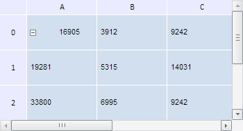

# TabSheetSettings.AdditionalExpanderOffset

TabSheetSettings.AdditionalExpanderOffset
-

**

# TabSheetSettings.AdditionalExpanderOffset

## Синтаксис

AdditionalExpanderOffset: Number

## Описание

Свойство AdditionalExpanderOffset**
 устанавливает и возвращает значение дополнительного отступа между кнопкой
 развертывания и текстом.

## Комментарии

Значение свойства можно установить из JSON и с помощью метода setAdditionalExpanderOffset, а возвратить
 - с помощью метода getAdditionalExpanderOffset.

По умолчанию значение свойства равно 2.

## Пример

Для выполнения примера необходимо наличие на html-странице компонента
 [TabSheet](../../Components/TabSheet/TabSheet/TabSheet.htm)
 с наименованием «tabSheet» (см. «[Пример
 создания компонента TabSheet](../../Components/TabSheet/TabSheet/TabSheet_Example.htm)»). Установим значение дополнительного
 отступа между кнопкой развертывания и текстом:

if (tabSheet.isLoaded()) {
    // Установим значение дополнительного отступа между кнопкой развертывания и текстом
    tabSheet.setAdditionalExpanderOffset(35);
    // Обновляем содержимое листа
    tabSheet.update()
};

В результате выполнения примера между кнопкой развёртывания и текстом
 был установлен отступ, равный 30 пикселям:

См. также:

[TabSheetSettings](TabSheetSettings.htm)

		Справочная
		 система на версию 10.9
		 от 18/08/2025,
		 © ООО «ФОРСАЙТ»,
