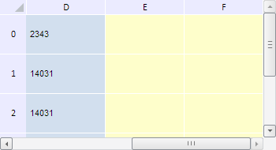

# TabSheetSettings.BackgroundCSS

TabSheetSettings.BackgroundCSS
-

**

# TabSheetSettings.BackgroundCSS

## Синтаксис

BackgroundCSS: String

## Описание

Свойство BackgroundCSS**
 устанавливает значение в стиль background для основного контейнера.

## Комментарии

Значение свойства можно установить из JSON и с помощью метода setBackgroundCSS, а возвратить -
 с помощью метода getBackgroundCSS.

По умолчанию свойство содержит пустую строку.

## Пример

Для выполнения примера необходимо наличие на html-странице компонента
 [TabSheet](../../Components/TabSheet/TabSheet/TabSheet.htm)
 с наименованием «tabSheet» (см. «[Пример
 создания компонента TabSheet](../../Components/TabSheet/TabSheet/TabSheet_Example.htm)»). Выполним прокрутку таблицы в правую
 сторону, изменим цвет заливки контейнера для данного компонента:

// Изменим цвет заливки контейнера для компонента
tabSheet.setBackgroundCSS("#FFFFCC");
// Установим количество строк в буфере асинхронного режима
tabSheet.setHorizontalExpandVolume(2);
// Получим элемент горизонтальной прокрутки
var hScrollBar = tabSheet.getHScrollBar();
// Выполним прокрутку
hScrollBar.scrollTo(tabSheet.getWidth(), true);
В результате выполнения примера таблица была прокручена горизонтально
 до её правой границы, а цвет заливки контейнера с таблицей был изменён
 на жёлтый:

См. также:

[TabSheetSettings](TabSheetSettings.htm)

		Справочная
		 система на версию 10.9
		 от 18/08/2025,
		 © ООО «ФОРСАЙТ»,
