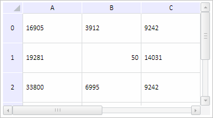

# TabSheetSettings.CellValue

TabSheetSettings.CellValue
-

# TabSheetSettings.CellValue

## Синтаксис

CellValue: Object;

## Описание

Свойство CellValue определяет
 значение ячейки таблицы.

## Комментарии

Значение свойства устанавливается с помощью метода setCellValue
 и возвращается при помощи метода getCellValue.
 Из JSON значение свойства задать нельзя.

При вызове метода setCellValue
 указываются следующие параметры: value - новое значение ячейки, rowIndex
 - индекс строки ячейки, colIndex - индекс столбца ячейки, fireEvent -
 признак генерации события, animate - признак воспроизведения анимации.

При вызове метода getCellValue
 указываются следующие параметры: rowIndex - индекс строки ячейки, colIndex
 - индекс столбца ячейки.

## Пример

Для выполнения примера необходимо наличие на html-странице компонента
 [TabSheet](../../Components/TabSheet/TabSheet/TabSheet.htm)
 с наименованием «tabSheet» (см. «[Пример
 создания компонента TabSheet](../../Components/TabSheet/TabSheet/TabSheet_Example.htm)»). Отключим перерисовку таблицы, установим
 новое значение ячейки, после чего включим перерисовку таблицы. Получим
 диапазон ячеек по строке и преобразуем его в формат табличной верстки,
 выведем индекс столбца по тексту его заголовка, получим координаты ячейки
 по строке и выведем их. Сделаем неактивными элементы горизонтальной и
 вертикальной прокрутки, выведем признак отрисовки компонента в асинхронном
 режиме и признак редактирования ячеек. Сделаем неактивной таблицу стилей.
 Выведем признаки наличия группировок и объектов в таблице:

// Отключим перерисовку таблицы
tabSheet.beginUpdate();
// Установим значение ячейки
tabSheet.setCellValue(50, 1, 1, true);
// Включим перерисовку таблицы
tabSheet.endUpdate();
// Получим диапазон ячеек по строке
var range = tabSheet.getRangeFromString("A0:A0");
// Получим и выведем индекс столбца по тексту его заголовка
var index = tabSheet.getColIndexByHeaderText("C");
console.log("Индекс столбца с заголовком 'C': " + index);
// Получим и выведем координаты ячейки
var coord = tabSheet.getCoordFromString("A1");
console.log("Координаты ячейки A1: (" + coord.colIndex + ", " + coord.rowIndex + ")");
// Сделаем неактивными элементы горизонтальной и вертикальной прокрутки
tabSheet.getHScrollBar().setEnabled(false);
tabSheet.getVScrollBar().setEnabled(false);
// Выведем признак отрисовки компонента в асинхронном режиме
console.log("Признак отрисовки компонента в асинхронном режиме: " + tabSheet.getIsAsyncScrolling());
// Выведем признак редактирования ячеек
console.log("Признак редактирования ячеек: " + tabSheet.getIsEditing());
// Сделаем неактивной таблицу стилей
tabSheet.getStyleSheet().disabled = true;
// Выведем признак наличия группировок в таблице
console.log("Признак наличия группировок в таблице: " + tabSheet.IsTabSheetExpandExist());
// Выведем признак наличия объектов в таблице
console.log("Признак наличия объектов в таблице: " + tabSheet.IsTabSheetTabObjectExist());

В результате выполнения примера было изменено значение указанной ячейки,
 элементы горизонтальной и вертикальной прокрутки стали неактивными, была
 отключена таблица стилей:

Также в консоли браузера были выведены следующие значения: результат
 преобразования диапазона ячеек в текст в формате табличной верстки, индекс
 столбца с указанным заголовком, координаты полученной ячейки, признак
 отрисовки компонента в асинхронном режиме, признак редактирования ячеек,
 признаки наличия группировок и объектов в таблице:

Результат преобразования диапазона: <table><tr><td
 style='background-color: #D2DFEE; font-family: Arial; font-size: 10.67px;
 color: #000000; text-decoration: underline ; vertical-align: top; text-align:
 left; word-wrap: break-word; padding: 5px 0px 5px 5px; '>16905</td></tr></table>

Индекс столбца с заголовком 'C': 2

Координаты ячейки A1: (0, 1)

Признак отрисовки компонента в асинхронном режиме:
 false

Признак редактирования ячеек: false

Признак наличия группировок в таблице: true

Признак наличия объектов в таблице: true

См. также:

[TabSheetSettings](TabSheetSettings.htm)

		Справочная
		 система на версию 10.9
		 от 18/08/2025,
		 © ООО «ФОРСАЙТ»,
