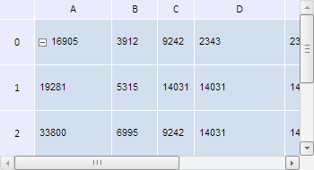

# TabSheetSettings.ColumnWidth

TabSheetSettings.ColumnWidth
-

**

# TabSheetSettings.ColumnWidth

## Синтаксис

ColumnWidth: Number

## Описание

Свойство ColumnWidth**
 определяет ширину указанной колонки таблицы.

## Комментарии

Значение свойства устанавливается с помощью метода setColumnWidth
 и возвращается при помощи метода getColumnWidth.
 Из JSON значение свойства задать нельзя.

При вызове метода setColumnWidth
 указываются два параметра: value - новое значение ширины колонки и colIndex
 - индекс колонки, для которой устанавливается ширина.

При вызове метода getColumnWidth
 указывается параметр colIndex - индекс колонки таблицы, значение ширины
 которой необходимо возвратить.

## Пример

Для выполнения примера необходимо наличие на html-странице компонента
 [TabSheet](../../Components/TabSheet/TabSheet/TabSheet.htm)
 с наименованием «tabSheet» (см. «[Пример
 создания компонента TabSheet](../../Components/TabSheet/TabSheet/TabSheet_Example.htm)»). Изменим ширину первых трёх столбцов
 таблицы:

// Обработаем событие RowColumnSizeChanged
tabSheet.RowColumnSizeChanged.add(
    function(sender, args) {
        console.log("Ширина столбца с индексом " + args.colIndexes[0] + ": " + args.newValue);
    }
);
// Изменим значения ширины столбцов таблицы
tabSheet.setColumnWidth(85, 0);
tabSheet.setColumnWidth(50, 1);
tabSheet.setColumnWidth(40, 2);

В результате выполнения примера была изменена ширина первых трёх столбцов
 таблицы:

После наступления события RowColumnSizeChanged
 в консоли браузера были выведены значения ширины столбцов:

Ширина столбца с индексом 0: 85

Ширина столбца с индексом 1: 50

Ширина столбца с индексом 2: 40

См. также:

[TabSheetSettings](TabSheetSettings.htm)

		Справочная
		 система на версию 10.9
		 от 18/08/2025,
		 © ООО «ФОРСАЙТ»,
