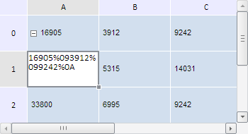

# TabSheetSettings.EnableCopyPaste

TabSheetSettings.EnableCopyPaste
-

**

# TabSheetSettings.EnableCopyPaste

## Синтаксис

EnableCopyPaste: Boolean

## Описание

Свойство EnableCopyPaste**
 управляет разрешением на выполнение операций копирования и вставки.

## Комментарии

Значение свойства устанавливается из JSON и с помощью метода **setEnableCopyPaste**
 и возвращается при помощи метода g**etEnableCopyPaste**.

Свойство содержит значение типа Boolean. Если оно равно true,
 то операции копирования и вставки в таблице разрешены, если false,
 то не разрешены.

По умолчанию свойство содержит значение true.

## Пример

Для выполнения примера необходимо наличие на html-странице компонента
 [TabSheet](../../Components/TabSheet/TabSheet/TabSheet.htm)
 с наименованием «tabSheet» (см. «[Пример
 создания компонента TabSheet](../../Components/TabSheet/TabSheet/TabSheet_Example.htm)»). Скопируем данные ячеек первой строки
 таблицы и вставим их в ячейки с координатами (1, 0) и (0,1), управляя
 при этом разрешением на выполнения операций копирования и вставки. Также
 обработаем события BeforyCopy
 и BeforePaste:

// Обработаем событие BeforeCopy
tabSheet.BeforeCopy.add(
    function(sender, args){
        console.log("Копируется следующий текст: " + args.PlaintText);
    }
);
// Обработаем событие BeforePaste
tabSheet.BeforePaste.add(
    function(sender, args){
        console.log("Начальная координата вставки: (" + args.StartCoord.rowIndex + ", " + args.StartCoord.colIndex + ")");
    }
);
// Получим диапазон ячеек с первой строкой
var range = tabSheet.getRange(0, 0, 2, 0);
// Выделяем первую строку
tabSheet.select(range, false);
// Разрешим копировать данные
tabSheet.setEnableCopyPaste(true);
// Разрешим синхронную подгрузку данных при копировании неподгруженных ячеек
tabSheet.setSyncLoadClipboardData(true);
// Определим режим вставки с форматированием
tabSheet.setPasteMode(PP.Ui.PasteMode.ContentAndStyle);
// Получаем данные выделенного диапазона
var values = tabSheet.copy();
// Вставим данные в ячейку с координатами (1, 0);
tabSheet.paste(escape(values), 1, 0);
// Теперь запретим вставлять данные
tabSheet.setEnableCopyPaste(false);
// Вставим данные в ячейку с координатами (1, 1);
tabSheet.paste(escape(values), 1, 1);

В результате выполнения примера в ячейку с координатами (1, 0) был вставлен
 форматированный текст с данными, скопированными из ячеек первой строки
 таблицы:

В консоли браузера в результате выполнения обработчиков событий BeforyCopy и BeforePast
 были выведены следующие сообщения:

Копируется следующий текст: 16905 3912 9242

Начальная координата вставки: (1, 0)

См. также:

[TabSheetSettings](TabSheetSettings.htm)

		Справочная
		 система на версию 10.9
		 от 18/08/2025,
		 © ООО «ФОРСАЙТ»,
