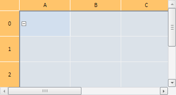

# TabSheetSettings.EnableDeleteTable

TabSheetSettings.EnableDeleteTable
-

**

# TabSheetSettings.EnableDeleteTable

## Синтаксис

EnableDeleteTable: Boolean

## Описание

Свойство EnableDeleteTable**
 устанавливает и возвращает признак возможности удаления данных сразу всей
 асинхронной таблицы.

## Комментарии

Значение свойства устанавливается из JSON и с помощью метода **set****EnableDeleteTable** и возвращается
 при помощи метода g**et****EnableDeleteTable**.

Свойство содержит значение типа Boolean. Если оно равно true,
 то удаление данных сразу всей таблицы возможно, если false,
 то не возможно.

По умолчанию значение свойства равно false.

## Пример

Для выполнения примера необходимо наличие на html-странице компонента
 [TabSheet](../../Components/TabSheet/TabSheet/TabSheet.htm)
 с наименованием «tabSheet» (см. «[Пример
 создания компонента TabSheet](../../Components/TabSheet/TabSheet/TabSheet_Example.htm)»), причём таблица должна быть асинхронной.
 Удалим данные всех ячеек таблицы, предварительно разрешив возможность
 выполнения данной операции:

// Определяем, является ли таблица асинхронной
if (tabSheet.getIsAsync()) {
    console.log("Таблица является асинхронной.");
    // Разрешим удалять данные всей таблицы
    tabSheet.setEnableDeleteTable(true);
}
// Выделим все ячейки
tabSheet.selectAll();
// Получим выделенную область
var range = tabSheet.getSelection(true).getSelectedRanges()[0];
// Удалим данные всех ячеек таблицы
tabSheet.deleteRange(range);

В результате выполнения примера будут выделены все ячейки и удалены
 их данные:

Также в консоли браузера было выведено сообщение, что таблица является
 асинхронной.

См. также:

[TabSheetSettings](TabSheetSettings.htm)

		Справочная
		 система на версию 10.9
		 от 18/08/2025,
		 © ООО «ФОРСАЙТ»,
